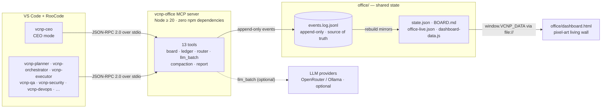
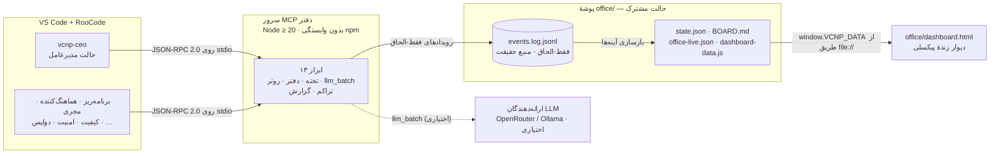

<div align="center">

🇬🇧 **English** · 🇮🇷 [فارسی](#farsi)

# 🏢 VCNP Vibe-Office Kit

### An AI company in a folder — one CEO mode, nine specialist roles, one shared event-sourced office.


**Roo modes · 7 skills · zero-dependency MCP server · pixel-art living-wall dashboard**

</div>

<a id="english"></a>

## 📖 About

**VCNP Vibe-Office** is a multi-agent “virtual office” kit for agentic coding. You talk to an AI CEO (`vcnp-ceo`) the way you would brief a real chief executive: it captures your goal, breaks it into tasks with acceptance criteria and token budgets, dispatches work to eight specialist roles, and tracks everything on a shared board.

The heart of the kit is its **shared office state**: an append-only event ledger (`office/events.log.jsonl`) that is the single source of truth. The kanban board, live signals and the dashboard are all *derived mirrors*, rebuilt from that ledger — history is never lost and every claim can be replayed.

It ships as **Roo modes + skills + a zero-dependency MCP server**, installs into any project with a one-command installer, and proves itself end-to-end with a golden-path demo.

> 🇮🇷 **Beginner or non-developer?** Start with the Persian-first manual: [`docs/RAHNAMA-FA.md`](docs/RAHNAMA-FA.md) · Developer reference: [`docs/README.md`](docs/README.md)

## ✨ Features

- 🏢 **CEO-led AI company** — 9 RooCode modes (`vcnp-ceo` … `vcnp-devops`), each with a written charter in `core/charters/`.
- 📒 **Ledger-first truth** — append-only `events.log.jsonl`; board, live signals and dashboard are rebuilt from it.
- 🔌 **Zero-dependency MCP server** — 13 tools in pure Node stdlib (`node:fs`, `node:crypto`, `readline`); JSON-RPC 2.0 over stdio.
- 🧾 **Envelope protocol** — Task Briefs and Result Reports validated against a JSON-Schema contract.
- 🚦 **Compaction gate** — `task_assign` refuses any session without a fresh `compaction_done`.
- 💸 **Cost truth** — every token line tagged `provider_usage` / `ide_export` / `estimated`; estimates are flagged approximate and never budget-enforced.
- 🧠 **Model router** — picks the cheapest model whose quality tier satisfies the task class (C0–C4).
- 📦 **Async `llm_batch`** — bulk jobs return a `batch_id` instantly; semantic cache included; fails *honestly* with `no provider configured` when no provider is set.
- 🖥️ **Living-wall dashboard** — a pixel-art office whose 9 employees act on *real* ledger events; Persian-first RTL UI; opens straight from `file://`.
- 🛡️ **Safety rails** — all writes confined to `office/`, atomic temp-file + rename state, exclusive-create lock with stale takeover, installers never overwrite existing files.

## 🏗️ Architecture



**Execution model:** coordination tooling (claude-flow / ruflo) acts as the *ledger* for memory, routing and swarm state, while executor agents (Codex / Roo modes) do the actual writing. Coordination calls record work — they never replace implementation.

**Data flow:** every action appends to the ledger → mirrors are regenerated (`report_generate`) → the dashboard reads a single-line `window.VCNP_DATA = {...}` payload, which is exactly what makes `file://` work without fetch/CORS.

## 🗂️ Repository layout

```text
📦 vcnp-vibe-office
├─ 📂 core/                   constitution · protocol · 9 role charters
│  ├─ constitution.md         the law every role obeys
│  ├─ protocol.md             envelope spec (Task Brief / Result Report)
│  └─ charters/               vcnp-ceo … vcnp-devops (9 charters)
├─ 📂 skills/                 7 skills (core trio + web-design, deploy-server,
│                             security-basics, smart-resources)
├─ 📂 mcp/vcnp-office-mcp/    MCP server: 13 tools · zero npm deps
├─ 📂 office/                 ⭐ shared state: events.log.jsonl (truth),
│                             BOARD.md · dashboard.html · memory-bank/
├─ 📂 templates/              dashboard templates (incl. pixel wall)
├─ 📂 demo/                   run-golden-path.js · built site in site/
├─ 📂 installer/              install / uninstall (ps1 + sh)
├─ 📂 adapters/roo/rules/     adapter rules
├─ 📂 docs/                   developer README · RAHNAMA-FA (beginner guide)
├─ 📂 plans/                  vcnp-vibe-office-plan.md (the blueprint)
└─ .roomodes.json             the 9 vcnp-* modes wired for RooCode
```

## 👥 The nine roles

| Role | Roo mode | What it does |
|---|---|---|
| 🧑‍💼 CEO | `vcnp-ceo` | Listens to you, turns goals into tasks, makes the final call |
| 📋 Planner | `vcnp-planner` | Breaks big work into small tasks with acceptance criteria |
| 🧭 Orchestrator | `vcnp-orchestrator` | Distributes tasks across agents, tracks progress |
| 👷 Executor | `vcnp-executor` | Builds code & content, reports results |
| ✅ QA | `vcnp-qa` | Checks outputs against acceptance criteria; approves or rejects |
| 🛡️ Security | `vcnp-security` | Reviews secrets, inputs and dependencies |
| 💰 Resource controller | `vcnp-resource-controller` | Watches token budget and cost |
| 📚 Librarian | `vcnp-librarian` | Keeps the Memory Bank and documents tidy |
| 🚀 DevOps | `vcnp-devops` | Runs, tests and deploys |

## 🚀 Quick start

### Prerequisites

| Need | Details |
|---|---|
| **Node.js ≥ 20** | LTS from [nodejs.org](https://nodejs.org) — check with `node --version` |
| **VS Code + RooCode** | to run the `vcnp-*` modes |
| *Optional:* API key or Ollama | only for `llm_batch` — e.g. `OPENROUTER_API_KEY`, or keyless local [Ollama](https://ollama.com) |

Everything else (board, gates, reports, dashboard) works fully offline.

### One-command install into any project

**Windows (PowerShell):**

```powershell
powershell -ExecutionPolicy Bypass -File installer\install.ps1 -Target "C:\path\to\your-project"
```

**macOS / Linux / Git Bash:**

```bash
bash installer/install.sh /path/to/project
```

Omit the target to install into the current folder. The installer:

1. verifies Node.js ≥ 20;
2. creates `office/` in the target **only if missing** (never overwrites existing files);
3. registers the `vcnp-office` MCP server in the target's `.mcp.json`, preserving every existing entry (and refusing to touch invalid JSON);
4. places a dashboard fallback at `office/dashboard.html`.

> 💡 Uninstall just as cleanly: `installer\uninstall.ps1` or `bash installer/uninstall.sh`. Your `office/` data is **kept** by default — pass `-DeleteOffice` / `--delete-office` to remove it too.

### Talk to the CEO

1. Open the project in **VS Code + RooCode**.
2. Switch to the **`vcnp-ceo`** mode (mode selector below the chat).
3. Describe your goal like you'd brief a CEO — tasks appear on the board.
4. Ask the CEO to run `report_generate` whenever you want the board and dashboard refreshed.

## 🔌 Office MCP server

Zero npm dependencies — pure Node stdlib.

```bash
cd mcp/vcnp-office-mcp
npm start        # node src/server.js — JSON-RPC 2.0 over stdio
npm test         # node test/smoke.js — end-to-end smoke test (22 checks)
```

Register in any MCP client (workspace root is resolved automatically; override with the `VCNP_OFFICE_WORKSPACE` env var):

```json
{
  "mcpServers": {
    "vcnp-office": {
      "command": "node",
      "args": ["/absolute/path/to/vcnp-kit/mcp/vcnp-office-mcp/src/server.js"]
    }
  }
}
```

### Tools (13)

| Tool | Purpose |
|---|---|
| `board_init(project_name, goal)` | Create/update the project header |
| `task_create(title, assignee_role, acceptance_criteria[], …)` | Issue a validated Task Brief envelope |
| `task_update(task_id, status?, progress_percent?, …)` | Result Report; `status:"done"` queues the task for the orchestrator |
| `task_assign(task_id, role, session_id?)` | Assignment **gate** — requires a fresh `compaction_done` |
| `board_read()` | Compact snapshot incl. the written queue |
| `ledger_log(role, task_id, tokens_used, source, …)` | Token usage with cost-truth tagging |
| `event_log(actor, action, detail?)` | Generic audit event |
| `telemetry_read()` | Per-role/per-model tokens, est. cost, latency, QA approvals |
| `route_model(task_class)` | Cheapest model meeting the class quality bar |
| `llm_batch_submit(jobs[], model_class)` | Async bulk jobs — instant `batch_id` |
| `llm_batch_status(batch_id)` | Batch/job states + failure reasons |
| `report_generate()` | Rebuilds `BOARD.md`, `office-live.json` and `dashboard-data.js` |
| `compaction_ack(session_id, util_after)` | Deterministic `compaction_done` writer (util ≤ 0.75 + Memory Bank updated) |

## 🖥️ Living-wall dashboard

Open **[`office/dashboard.html`](office/dashboard.html)** directly in any browser (double-click — no server needed): project header with overall progress, kanban columns (*Todo / Doing / Awaiting Orchestrator / Review / Blocked / Done*), per-role signal chips, last-events feed — plus a pixel-art scene where 9 tiny employees work, think, drink coffee and sleep according to **real** ledger events, with a day/night cycle following your system clock.

Refresh its data by regenerating reports:

```bash
node -e "require('./mcp/vcnp-office-mcp/src/tools/report').generate()"
```

## 🪄 Golden-path demo

```bash
node demo/run-golden-path.js
```

Drives the store engine directly through the full pipeline — board init → 3 task briefs → executor result reports → simulated QA passes → queue drain to *Done* — printing a beginner-friendly trace of every office action. Built output: [`demo/site/index.html`](demo/site/index.html).

## 🧩 Skills

| Skill | Focus |
|---|---|
| `core-constitution` | The office constitution every role must obey |
| `core-protocol` | Task Brief / Result Report envelope contract (+ `references/envelope-schema.json`) |
| `core-board-ops` | Safe day-to-day operations on the shared board & ledger |
| `web-design` | UI guidance + `assets/design-system-starter.css` design tokens |
| `deploy-server` | Deployment routines (+ `references/deploy-checklists.md`) |
| `security-basics` | Security hygiene: secrets, inputs, dependencies |
| `smart-resources` | Token- and cost-aware resource usage |

<details>
<summary>⚙️ Configuration</summary>

**Provider configuration (`llm_batch`)** — optional `office/models.json`. Keys are referenced by env-var **name** only; raw secrets live in `.env`, never in config:

```json
{
  "providers": [
    { "id": "openrouter", "base_url_env": "OPENROUTER_BASE_URL", "key_env": "OPENROUTER_API_KEY", "kind": "openai-compatible" },
    { "id": "local", "base_url_env": "OLLAMA_BASE_URL", "key_env": null, "kind": "openai-compatible" }
  ],
  "models": [
    { "id": "economy-fast", "provider": "openrouter", "model_ref": "...", "in_price": 0.05, "out_price": 0.2, "ctx": 128000, "quality_tier": 1 }
  ]
}
```

Without a reachable provider, `llm_batch_submit` still works — every job completes honestly as failed with `no provider configured`.

**Workspace override** — the server resolves the workspace root (home of `office/`) by walking up from `src/server.js`; set `VCNP_OFFICE_WORKSPACE` to force an explicit path.

</details>

<details>
<summary>🩹 Troubleshooting — five common errors</summary>

1. **“Node.js version 20 or newer is required…”** — Node is missing or old. Install the LTS from [nodejs.org](https://nodejs.org), reopen the terminal, rerun the installer.
2. **“existing .mcp.json is not valid JSON – aborting to avoid data loss”** — the target's `.mcp.json` is corrupt; the installer deliberately won't touch it. Fix the JSON (usually a stray comma) or rename it temporarily, then reinstall.
3. **Dashboard says “no data yet”** — normal before the first report. Ask the CEO to run `report_generate`, then refresh the page.
4. **`vcnp-office` tools invisible in RooCode** — make sure `args` holds an **absolute** path, then Reload Window once.
5. **`llm_batch` jobs finish with `no provider configured`** — neither an API key nor Ollama is available. Set the env vars (e.g. `OPENROUTER_API_KEY`) or start Ollama. This is honest failure reporting, not a bug.

</details>

## 🗺️ Roadmap

- [ ] Full JSON-Schema envelope evaluation (today: lightweight zero-dep approximation)
- [ ] Out-of-process batch worker (batches currently live inside the server process)
- [ ] Provider/model presets for `office/models.json`
- [ ] Dashboard language toggle (currently Persian-first)
- [ ] Public packaging & release (repository is currently private)

## 🤝 Contributing

- Conventional commits: `feat`, `fix`, `docs`, `style`, `refactor`, `perf`, `test`, `chore` — e.g. `feat(board): add blocker reasons`.
- Keep files under 500 lines · no hardcoded secrets · validate input at boundaries.
- TDD preferred (London school, mock-first).
- Multi-file changes (3+) go through the hierarchical swarm; single-file fixes go direct.

## 📄 License

This repository is currently **private** — no open-source license has been published yet. All rights reserved by the maintainers until a license is added.

---

<div align="center">

Built with ☕ and append-only events.

</div>

---

<a id="farsi"></a>

<div dir="rtl">

🇮🇷 **فارسی** · 🇬🇧 [English](#english)

# 🏢 کیت وی‌سی‌ان‌پی وایب‌آفیس

### یک شرکتِ هوش مصنوعی در یک پوشه — یک حالت مدیرعامل، نه نقش تخصصی، یک دفتر رویدادمحورِ مشترک.


## 📖 دربارهٔ کیت

**وی‌سی‌ان‌پی وایب‌آفیس** یک کیت «دفتر مجازی» چندعاملی برای کدنویسی عامل‌محور است. شما با یک مدیرعامل هوش مصنوعی (`vcnp-ceo`) مثل یک مدیرعامل واقعی حرف می‌زنید: او هدف شما را ثبت می‌کند، آن را به تسک‌هایی با معیار پذیرش و بودجهٔ توکن تبدیل می‌کند، کار را بین هشت نقش تخصصی پخش می‌کند و همه‌چیز را روی یک تختهٔ مشترک دنبال می‌کند.

قلب کیت، **حالت مشترک دفتر** است: دفتر رویدادِ فقط-الحاق (`office/events.log.jsonl`) که تنها منبع حقیقت است. تختهٔ کانبان، سیگنال‌های زنده و داشبورد همه *آینه‌های مشتق‌شده*اند و از روی همین دفتر بازسازی می‌شوند — تاریخچه هرگز از بین نمی‌رود و هر ادعا قابل بازپخش است.

این کیت به شکل **حالت‌های Roo + مهارت‌ها + یک سرور MCP بدون وابستگی** عرضه می‌شود، با نصابِ تک‌دستوری وارد هر پروژه‌ای می‌شود و خودش را با دموی مسیر طلایی اثبات می‌کند.

> 📚 راهنمای گام‌به‌گام مقدماتی (فارسی‌محور): [`docs/RAHNAMA-FA.md`](docs/RAHNAMA-FA.md) · مرجع فنی توسعه‌دهندگان: [`docs/README.md`](docs/README.md)

## ✨ ویژگی‌ها

- 🏢 **شرکتِ AI با مدیریت مدیرعامل‌محور** — ۹ حالت RooCode با منشور مکتوب در `core/charters/`.
- 📒 **حقیقتِ دفتر-محور** — `events.log.jsonl` فقط-الحاق؛ تخته، سیگنال‌ها و داشبورد از روی آن بازسازی می‌شوند.
- 🔌 **سرور MCP بدون هیچ وابستگی** — ۱۳ ابزار فقط با کتابخانهٔ استاندارد Node؛ پروتکل JSON-RPC 2.0 روی stdio.
- 🧾 **پروتکل پاکت** — بریف تسک و گزارش نتیجه با اعتبارسنجی مطابق قرارداد JSON-Schema.
- 🚦 **گیت تراکم** — `task_assign` تا نشستِ `compaction_done` تازه نداشته باشد امتناع می‌کند.
- 💸 **صداقت در هزینه** — هر خط توکن با برچسب `provider_usage` / `ide_export` / `estimated`؛ تخمین‌ها علامت می‌خورند و هرگز در سقف بودجه لحاظ نمی‌شوند.
- 🧠 **روتر مدل** — ارزان‌ترین مدلی که سطح کیفیِ کلاس تسک (C0 تا C4) را پاس کند.
- 📦 **`llm_batch` ناهمگام** — کارهای دسته‌ای بی‌درنگ `batch_id` می‌گیرند؛ کش معنایی دارد؛ بدون ارائه‌دهنده صادقانه با «no provider configured» شکست می‌خورد.
- 🖥️ **دیوار زنده** — دفتر پیکسلی که ۹ کارمندش بر اساس *رویدادهای واقعی* حرکت می‌کنند؛ رابط فارسی و راست‌به‌چپ؛ مستقیم از `file://` باز می‌شود.
- 🛡️ **ریل‌های ایمنی** — همهٔ نوشتن‌ها محدود به `office/`، نوشتن اتمیک (فایل موقت + تغییر نام)، قفل با پس‌گیری stale، و نصاب‌هایی که هرگز فایل موجود را بازنویسی نمی‌کنند.

## 🏗️ معماری



**مدل اجرا:** ابزارهای هماهنگی (claude-flow / ruflo) نقش *دفتر کل* حافظه، مسیریابی و وضعیت سوآرم را دارند و عامل‌های مجری (Codex / حالت‌های Roo) واقعاً می‌نویسند. فراخوانی هماهنگی فقط ثبت می‌کند و هرگز جای پیاده‌سازی را نمی‌گیرد.

**جریان داده:** هر اقدام به دفتر افزوده می‌شود ← آینه‌ها بازتولید می‌شوند (`report_generate`) ← داشبورد یک تک‌خط `window.VCNP_DATA = {...}` را می‌خواند؛ همان چیزی که باز شدن از `file://` را بدون fetch/CORS ممکن می‌کند.

## 🗂️ ساختار پوشه‌ها

```text
📦 vcnp-vibe-office
├─ 📂 core/                   قانون اساسی · پروتکل · ۹ منشور نقش
├─ 📂 skills/                 ۷ مهارت (سه‌گانهٔ هسته + طراحی وب، استقرار، امنیت، منابع)
├─ 📂 mcp/vcnp-office-mcp/    سرور MCP: ۱۳ ابزار · بدون وابستگی npm
├─ 📂 office/                 ⭐ حالت مشترک: events.log.jsonl (حقیقت) ·
│                             BOARD.md · dashboard.html · memory-bank/
├─ 📂 templates/              قالب‌های داشبورد (از جمله دیوار پیکسلی)
├─ 📂 demo/                   run-golden-path.js · سایت ساخته‌شده در site/
├─ 📂 installer/              نصب / حذف (ps1 + sh)
├─ 📂 adapters/roo/rules/     قواعد آداپتور
├─ 📂 docs/                   README توسعه‌دهندگان · RAHNAMA-FA (راهنمای مقدماتی)
├─ 📂 plans/                  نقشهٔ کامل پروژه
└─ .roomodes.json             ۹ حالت vcnp-* برای RooCode
```

## 👥 نقش‌ها در یک نگاه

| نقش | حالت Roo | کارش چیست؟ |
|---|---|---|
| 🧑‍💼 مدیرعامل | `vcnp-ceo` | گوش می‌دهد، هدف را به تسک تبدیل می‌کند، تصمیم نهایی را می‌گیرد |
| 📋 برنامه‌ریز | `vcnp-planner` | کار بزرگ را به تسک‌های کوچک با معیار پذیرش می‌شکند |
| 🧭 هماهنگ‌کننده | `vcnp-orchestrator` | تسک‌ها را بین عامل‌ها پخش و پیشرفت را دنبال می‌کند |
| 👷 مجری | `vcnp-executor` | کد و محتوا می‌سازد و گزارش نتیجه می‌دهد |
| ✅ کنترل کیفیت | `vcnp-qa` | خروجی را با معیارهای پذیرش می‌سنجد و تأیید/رد می‌کند |
| 🛡️ امنیت | `vcnp-security` | رازها، ورودی‌ها و وابستگی‌ها را بررسی می‌کند |
| 💰 کنترل منابع | `vcnp-resource-controller` | بودجهٔ توکن و هزینه را پایش می‌کند |
| 📚 کتابدار | `vcnp-librarian` | بانک حافظه و اسناد پروژه را نگه می‌دارد |
| 🚀 دواپس | `vcnp-devops` | اجرا، تست و استقرار را سر و سامان می‌دهد |

## 🚀 شروع سریع

### پیش‌نیازها

| نیاز | توضیح |
|---|---|
| **Node.js نسخهٔ ۲۰ یا بالاتر** | نسخهٔ LTS از [nodejs.org](https://nodejs.org) — بررسی با `node --version` |
| **VS Code + RooCode** | برای اجرای حالت‌های `vcnp-*` |
| *اختیاری:* کلید API یا Ollama | فقط برای `llm_batch` — مثلاً `OPENROUTER_API_KEY` یا [Ollama](https://ollama.com) محلی و بدون کلید |

بقیهٔ چیزها (تخته، گیت‌ها، گزارش‌ها، داشبورد) کاملاً آفلاین کار می‌کنند.

### نصب تک‌دستوری در هر پروژه

**ویندوز (PowerShell):**

```powershell
powershell -ExecutionPolicy Bypass -File installer\install.ps1 -Target "C:\مسیر\پروژهٔ-شما"
```

**مک / لینوکس / Git Bash:**

```bash
bash installer/install.sh /path/to/project
```

اگر مسیر ندهید، همان پوشهٔ فعلی نصب می‌شود. نصاب چه‌کار می‌کند؟

۱. وجود Node.js ≥ ۲۰ را بررسی می‌کند؛ ۲. پوشهٔ `office/` را در مقصد **فقط اگر وجود نداشته باشد** می‌سازد (هرگز فایل موجود را بازنویسی نمی‌کند)؛ ۳. سرور `vcnp-office` را در `.mcp.json` مقصد ثبت می‌کند و بقیهٔ ورودی‌ها را دست‌نخورده نگه می‌دارد (با JSON خراب اصلاً کاری ندارد)؛ ۴. یک نسخهٔ داشبورد به‌عنوان جایگزین در `office/dashboard.html` می‌گذارد.

> 💡 حذف نصب هم ساده است: `installer\uninstall.ps1` یا `bash installer/uninstall.sh`. داده‌های `office/` به‌طور پیش‌فرض **حفظ می‌شوند**؛ فقط با پرچم `-DeleteOffice` / `--delete-office` حذف می‌شوند.

### با مدیرعامل حرف بزنید

۱. پروژه را در **VS Code + RooCode** باز کنید. ۲. از انتخاب‌گر حالت، **`vcnp-ceo`** را برگزینید. ۳. هدف‌تان را مثل briefing با یک مدیرعامل بگویید — تسک‌ها روی تخته ظاهر می‌شوند. ۴. هر وقت خواستید تخته و داشبورد تازه شوند، از مدیرعامل بخواهید `report_generate` را اجرا کند.

## 🔌 سرور MCP دفتر

بدون هیچ وابستگی npm — فقط کتابخانهٔ استاندارد Node.

```bash
cd mcp/vcnp-office-mcp
npm start        # node src/server.js — پروتکل JSON-RPC 2.0 روی stdio
npm test         # node test/smoke.js — تست دود سرتاسری (۲۲ بررسی)
```

ثبت در هر کلاینت MCP (ریشهٔ ورک‌اسپیس خودکار پیدا می‌شود؛ با متغیر `VCNP_OFFICE_WORKSPACE` می‌توانید مسیر را اجباری کنید):

```json
{
  "mcpServers": {
    "vcnp-office": {
      "command": "node",
      "args": ["/absolute/path/to/vcnp-kit/mcp/vcnp-office-mcp/src/server.js"]
    }
  }
}
```

### ابزارها (۱۳)

| ابزار | کارکرد |
|---|---|
| `board_init` | ساخت/به‌روزرسانی سربرگ پروژه |
| `task_create` | صدور بریف تسک با اعتبارسنجی |
| `task_update` | گزارش نتیجه؛ `status:"done"` تسک را به صف انتظار ارکستراتور می‌فرستد |
| `task_assign` | **گیت** تخصیص — نیازمند `compaction_done` تازه |
| `board_read` | اسنپ‌شات فشردهٔ تخته به‌همراه صف نوشته‌شده‌ها |
| `ledger_log` | ثبت مصرف توکن با برچسب منبع |
| `event_log` | رویداد ممیزی عمومی |
| `telemetry_read` | توکن/هزینهٔ تخمینی/تأخیر به تفکیک نقش و مدل |
| `route_model` | ارزان‌ترین مدلِ واجد شرایط کلاس تسک |
| `llm_batch_submit` | کارهای دسته‌ای ناهمگام — `batch_id` فوری |
| `llm_batch_status` | وضعیت دسته/کارها و علل شکست |
| `report_generate` | بازسازی `BOARD.md`، `office-live.json` و `dashboard-data.js` |
| `compaction_ack` | نوشتن قطعی `compaction_done` (مصرف ≤ ۰٫۷۵ + به‌روزرسانی بانک حافظه) |

## 🖥️ دیوار زنده

فایل **[`office/dashboard.html`](office/dashboard.html)** را مستقیم در مرورگر باز کنید (دابل‌کلیک — بدون نیاز به سرور): سربرگ پروژه با درصد پیشرفت کلی، ستون‌های کانبان (*انجام نشده / در حال انجام / در انتظار ارکستراتور / بازبینی / مسدود / انجام شده*)، چیپ وضعیت هر نقش و فهرست آخرین رویدادها — به‌علاوهٔ صحنهٔ پیکسلی که ۹ کارمند کوچکش بر اساس **رویدادهای واقعی** دفتر کار می‌کنند، فکر می‌کنند، قهوه می‌خورند و می‌خوابند؛ روز و شبِ صحنه هم از ساعت واقعی سیستم پیروی می‌کند.

برای به‌روزرسانی داده‌ها، گزارش‌ها را از نو بسازید:

```bash
node -e "require('./mcp/vcnp-office-mcp/src/tools/report').generate()"
```

## 🪄 دموی مسیر طلایی

```bash
node demo/run-golden-path.js
```

موتور ذخیره‌سازی را مستقیم در کل خط لوله می‌رانَد — مقداردهی تخته ← ۳ بریف تسک ← گزارش‌های مجری ← تأیید شبیه‌سازی‌شدهٔ QA ← تخلیهٔ صف تا «انجام شده» — و ردپای گام‌به‌گام هر اقدام دفتر را برای تازه‌کارها چاپ می‌کند. خروجی ساخته‌شده: [`demo/site/index.html`](demo/site/index.html).

## 🧩 مهارت‌ها

| مهارت | تمرکز |
|---|---|
| `core-constitution` | قانون اساسی دفتر که همهٔ نقش‌ها باید اطاعت کنند |
| `core-protocol` | قرارداد پاکت بریف تسک / گزارش نتیجه (+ `references/envelope-schema.json`) |
| `core-board-ops` | عملیات روزمرهٔ امن روی تخته و دفتر مشترک |
| `web-design` | راهنمای رابط کاربری + توکن‌های طراحی در `assets/design-system-starter.css` |
| `deploy-server` | روتین‌های استقرار (+ `references/deploy-checklists.md`) |
| `security-basics` | بهداشت امنیتی: رازها، ورودی‌ها، وابستگی‌ها |
| `smart-resources` | مصرف آگاهانهٔ توکن و هزینه |

<details>
<summary>⚙️ تنظیمات</summary>

**پیکربندی ارائه‌دهنده‌ها (`llm_batch`)** — فایل اختیاری `office/models.json`. کلیدها فقط با **نامِ** متغیر محیطی ارجاع می‌شوند؛ رازهای خام در `.env` می‌مانند، هرگز در کانفیگ:

```json
{
  "providers": [
    { "id": "openrouter", "base_url_env": "OPENROUTER_BASE_URL", "key_env": "OPENROUTER_API_KEY", "kind": "openai-compatible" },
    { "id": "local", "base_url_env": "OLLAMA_BASE_URL", "key_env": null, "kind": "openai-compatible" }
  ],
  "models": [
    { "id": "economy-fast", "provider": "openrouter", "model_ref": "...", "in_price": 0.05, "out_price": 0.2, "ctx": 128000, "quality_tier": 1 }
  ]
}
```

بدون ارائه‌دهندهٔ در دسترس، `llm_batch_submit` همچنان کار می‌کند — هر کار صادقانه با `no provider configured` شکست خورده علامت می‌خورد.

**تعیین دستی ورک‌اسپیس** — سرور ریشهٔ ورک‌اسپیس (خانهٔ `office/`) را با بالا رفتن از `src/server.js` پیدا می‌کند؛ برای اجبار به مسیر مشخص، `VCNP_OFFICE_WORKSPACE` را تنظیم کنید.

</details>

<details>
<summary>🩹 عیب‌یابی — پنج خطای رایج</summary>

۱. **«Node.js version 20 or newer is required…»** — Node نصب نیست یا قدیمی است. LTS را از [nodejs.org](https://nodejs.org) نصب کنید، ترمینال را بسته و باز کنید، نصاب را دوباره اجرا کنید.

۲. **«existing .mcp.json is not valid JSON – aborting to avoid data loss»** — فایل `.mcp.json` مقصد خراب است و نصاب عمداً به آن دست نمی‌زند. خطای JSON را درست کنید (معمولاً ویرگول اضافه) یا موقتاً تغییر نام دهید و دوباره نصب کنید.

۳. **داشبورد می‌گوید «داده‌ای نرسیده»** — قبل از اولین گزارش طبیعی است. از مدیرعامل بخواهید `report_generate` را اجرا کند، بعد صفحه را رفرش کنید.

۴. **ابزارهای `vcnp-office` در RooCode دیده نمی‌شوند** — مطمئن شوید `args` یک مسیر **مطلق** است، بعد یک بار Reload Window کنید.

۵. **کارهای `llm_batch` با «no provider configured» تمام می‌شوند** — نه کلید API تنظیم شده و نه Ollama در دسترس است. متغیرهای محیطی (مثل `OPENROUTER_API_KEY`) را تنظیم کنید یا Ollama را اجرا کنید. این گزارشِ صادقانهٔ شکست است، نه باگ.

</details>

## 🗺️ نقشهٔ راه

- [ ] اعتبارسنجی کامل JSON-Schema برای پاکت‌ها (امروز: تقریب سبکِ بدون وابستگی)
- [ ] ورکر دسته‌ای خارج از پروسهٔ سرور (دسته‌ها فعلاً داخل پروسهٔ سرور زندگی می‌کنند)
- [ ] پیش‌تنظیم ارائه‌دهنده/مدل برای `office/models.json`
- [ ] کلید تغییر زبان داشبورد (فعلاً فارسی‌محور)
- [ ] انتشار عمومی و بسته‌بندی (مخزن فعلاً خصوصی است)

## 🤝 مشارکت

- کامیت‌های قراردادی: `feat`، `fix`، `docs`، `style`، `refactor`، `perf`، `test`، `chore` — مثلاً `feat(board): add blocker reasons`.
- فایل‌ها زیر ۵۰۰ خط · بدون راز هاردکدشده · اعتبارسنجی ورودی در مرزها.
- TDD ترجیح داده می‌شود (مدرسهٔ لندنی، ماک-اول).
- تغییرات چندفایلی (۳ فایل به بالا) از سوآرم سلسله‌مراتبی می‌گذرد؛ اصلاحات تک‌فایلی مستقیم.

## 📄 مجوز

این مخزن در حال حاضر **خصوصی** است و هنوز مجوز متن‌باز منتشر نشده است. تا زمان افزودن مجوز، تمام حقوق برای نگه‌دارندگان پروژه محفوظ است.

---

<div align="center">

ساخته‌شده با ☕ و رویدادهای فقط-الحاق.

</div>

</div>
