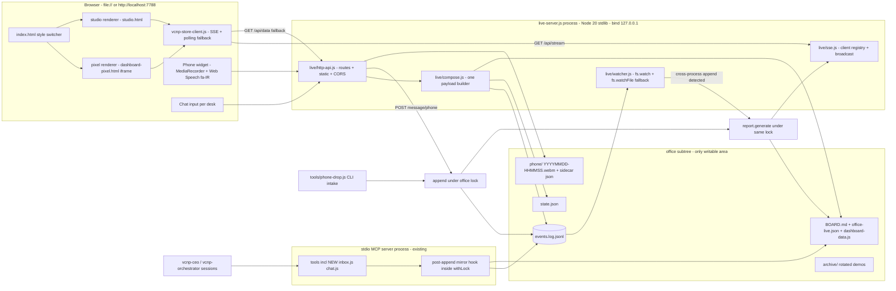

# Live Office — Technical Design / طراحی دفتر زنده

> Goal: make the VCNP virtual office **fully alive** — self-updating dashboard, visible conversations,
> artifact cards at desks, real event-driven meetings, an honest typed-chat queue, a telephone exchange
> (تلفنخانه), and two switchable visual styles — while keeping the append-only ledger
> [`office/events.log.jsonl`](../office/events.log.jsonl) as the single source of truth and
> **zero npm dependencies** (Node >= 20 stdlib, Windows 10).

Status: DESIGN (approved Scenario A "honest queue"). Implementation plan for modes: code / debug / qa.
Predecessor: [`plans/vcnp-vibe-office-plan.md`](vcnp-vibe-office-plan.md) (§ references below point there).

---

## 0. Decision Summary / خلاصه تصمیم‌ها

| # | Question | Decision | Why |
|---|----------|----------|-----|
| D1 | Where does the live server live? | **Inside the MCP package**: [`mcp/vcnp-office-mcp/src/live-server.js`](../mcp/vcnp-office-mcp/src/live-server.js) + `src/live/*.js` modules | Reuses `store.js`, `report.js`, workspace resolution and the zero-dep `package.json`; no second package to install; still a **separate process** from the stdio MCP server (stdout purity preserved) |
| D2 | Who regenerates mirrors after an append? | **Both**, serialized by the existing office lock: (a) post-append hook inside `store.withLock` (covers MCP-only usage), (b) ledger watcher in live-server (covers cross-process appends) | Fixes "mirrors only regenerate manually" even when the server is off; watcher catches appends made by other processes; lock + atomic rename make every path race-safe |
| D3 | Chat model | **Scenario A honest queue** — typed text becomes `message_posted` ledger events; a real vcnp-ceo/vcnp-orchestrator session drains via new MCP tools `inbox_list` / `inbox_reply` and answers with `message_answered`. No hidden LLM calls. Empty inbox worker ⇒ UI says «در انتظار نشست» / "awaiting session" | Nothing cosmetic fakery |
| D4 | Style switcher mechanics | Chooser page `office/live/index.html?style=pixel|studio`; pixel = existing [`templates/dashboard-pixel.html`](../templates/dashboard-pixel.html) in an `<iframe>`; studio = ported renderer `office/live/studio.html`. Shared modules: `vcnp-store-client.js`, `vcnp-normalize.js` | Both children load `../dashboard-data.js` via plain `<script src>` so **file:// keeps working**; SSE added as a progressive enhancement inside each page |
| D5 | Phone audio upload transport | `POST /api/phone` with JSON `{audio_base64, mime, transcript|null, lang, duration_ms}` | Avoids hand-rolled multipart parsing in a zero-dep server; ≤2 min Opus ≈ 0.5 MB ⇒ ~0.7 MB base64, acceptable on localhost |
| D6 | Demo reset | Rotation, not deletion: `tools/demo-reset.js` moves ledger+mirrors into `office/archive/<stamp>/` then bootstraps a fresh project | Append-only philosophy preserved (history archived intact, never edited) |

---

## 1. Component Architecture / معماری اجزا

### 1.1 Diagram



### 1.2 Server location & lifecycle (D1)

* Entry: `node mcp/vcnp-office-mcp/src/live-server.js` (also `npm run live` script added to
  [`mcp/vcnp-office-mcp/package.json`](../mcp/vcnp-office-mcp/package.json)).
* Modules (each well under 500 lines):
  * `src/live/http-api.js` — routing, static file serving (office subtree only), CORS, body limits.
  * `src/live/sse.js` — `EventSource` endpoint, heartbeat comments every 15 s, client set, broadcast.
  * `src/live/compose.js` — builds ONE payload from ledger + state + mirrors + chat/meetings (§1.4).
  * `src/live/watcher.js` — ledger change detection (§4).
  * `src/live/inbox-core.js` — pure inbox queries shared by MCP tools and HTTP API (§3).
* Config: `PORT` default **7788** (env `VCNP_OFFICE_PORT`), bind **127.0.0.1 only**.
* Writes confined to `office/` (static serving also rooted there + `templates/` read-only).
* stdout stays clean (diagnostics → stderr) so the file can never be confused with the stdio server.

### 1.3 HTTP API

| Method & path | Body / params | Response | Notes |
|---|---|---|---|
| `GET /api/stream` | — | `text/event-stream`; events: `payload` (full composed JSON), `ping` | Client replays last `Last-Event-ID` as `?since=` seq; server resends full payload (simple, idempotent) |
| `GET /api/data` | — | Full composed payload (same JSON as SSE `payload`) | Polling fallback; also what `dashboard-data.js` mirrors (minus `server.live`) |
| `POST /api/message` | `{to_role, text}` → validates `to_role ∈ ROLES`, `text` 1..2000 chars | `{ok, event_id, message_id}` | Appends `message_posted` (§2); 429 rate-limit: max 10 msg/min/IP |
| `POST /api/phone` | `{audio_base64, mime, transcript?, lang?, duration_ms}` | `{ok, event_id, audio_ref, message_id}` | Saves `office/phone/<stamp>.webm` + sidecar `.json`, appends `phone_call_received` + paired `message_posted` (§6) |
| `GET /api/inbox` | `?role=ceo&include_answered=0` | `{pending:[…], answered_recent:[…]}` | Same code path as MCP `inbox_list` |
| `GET /api/audio/<file>` | — | `audio/webm` stream | Serves ONLY files inside `office/phone/` (realpath containment check) |
| `OPTIONS *` | — | 204 + CORS headers | Preflight for file:// pages |

CORS: `Access-Control-Allow-Origin: *` — deliberate: pages opened from `file://` have an opaque origin
and must still reach `http://localhost:7788`; server holds no secrets and binds loopback only
(risk R6).

### 1.4 Composed payload (single shape everywhere)

`compose.build()` returns (and `report_generate` persists into `dashboard-data.js`):

```json
{
  "schema_version": "1.0",
  "generated_ts": "2026-08-25T15:00:00.000Z",
  "state":   { "project": {}, "tasks": [], "events_count": 32 },
  "live":    { "roles": [ { "role": "ceo", "active_role": false, "last_event_time": null,
                             "mood": "sleeping", "energy_hint": 0 } ] },
  "recent_events": [ { "ts": "...", "actor": "qa", "action": "qa_review_passed", "task_id": "T-004" } ],
  "chat": {
    "messages": [ { "message_id": "m-0007", "kind": "message_posted", "ts": "...",
                    "from": "user", "to_role": "ceo", "text": "سلام",
                    "answer": { "ts": "...", "actor": "ceo", "text": "..." } | null } ],
    "inbox": { "total_pending": 2, "pending_by_role": { "ceo": 2 } }
  },
  "meetings": { "active": null, "recent": [ { "meeting_id": "mt-003", "reason": "qa_gate",
                "participants": ["qa","executor","orchestrator"], "started_ts": "...", "ended_ts": "..." } ] },
  "phone": { "recent": [ { "call_id": "ph-002", "ts": "...", "transcript": "...",
             "audio_ref": "office/phone/20260825-181500.webm", "has_transcript": true } ] },
  "server": { "live": true, "ledger_seq": 57, "port": 7788 }
}
```

Rules:
* `chat.messages` joins each `message_posted` with its `message_answered` (via `reply_to`) —
  renderers never join events themselves.
* `server.live=false` + empty `chat/meetings/phone` arrays in the static `dashboard-data.js`
  snapshot ⇒ pages know they are offline and show the honest badge «حالت آفلاین».
* Composition reads: `store.readEvents()` (memoized), `engine.foldState()` (memoized),
  `deriveOfficeLive()` — one disk read per update thanks to existing caches in
  [`lib/ledger-engine.js`](../mcp/vcnp-office-mcp/src/lib/ledger-engine.js).

---

## 2. Ledger Event Schema Additions / اسکیمای رویدادهای جدید

Base envelope follows [`lib/ledger-engine.js`](../mcp/vcnp-office-mcp/src/lib/ledger-engine.js:187)
conventions: every event gets `event_id` (UUID), `ts` (ISO), `schema_version:"1.0"`, plus `actor`,
`action` and free extra fields. The strict `additionalProperties:false` contract in
[`skills/core-protocol/references/envelope-schema.json`](../skills/core-protocol/references/envelope-schema.json)
applies to **Task Brief / Result Report envelopes only** — ledger events stay open, but their shapes
are fixed here so renderers and tests can rely on them. None of these actions change the
`stateFromEvents` fold (chat/meetings stay query-time views over the ledger; `state.json` schema is
untouched ⇒ old mirrors/tests keep passing).

| action | actor | fields (exact) | produced by |
|---|---|---|---|
| `message_posted` | `"user"` | `message_id:string (m-NNNN, allocated under lock)`, `to_role:ROLES[]`, `text:string(1..2000)`, `channel:"web"\|"cli"\|"phone"` | `POST /api/message`, `tools/phone-drop.js`, phone flow |
| `message_answered` | answering role | `message_id:string (reply target)`, `reply_to:event_id of message_posted`, `text:string(1..4000)` | MCP `inbox_reply` |
| `phone_call_received` | `"user"` | `call_id:string (ph-NNNN)`, `transcript:string\|null`, `audio_ref:"office/phone/<file>.webm"`, `mime:string`, `duration_ms:int>=0`, `lang:"fa-IR"`, `has_transcript:bool`, `paired_message_id:string` | `POST /api/phone`, CLI `--audio` |
| `meeting_started` | `orchestrator` (or triggering role) | `meeting_id:string (mt-NNNN)`, `reason:"qa_gate"\|"critical_task"\|"standup"\|"phone"\|"explicit"`, `participants:ROLES[] (2..9)`, `task_id?:string`, `topic:string<=200` | MCP `meeting_start` (thin wrapper over `event_log`) |
| `meeting_ended` | same actor as start | `meeting_id`, `outcome_summary:string<=300` | MCP `meeting_end` |
| `work_logged` | any role | `task_id?:string`, `action_summary:string(1..300)`, `artifact_refs:string[] (workspace-relative paths)`, `code_ref?:{path, lines:[from,to]}` | MCP `work_log` (charters make it mandatory, §3.3) |
| `session_lifecycle` | any role | `phase:"start"\|"end"`, `session_id:string`, `note?:string` | charters: first/last MCP call of every session |

Validation helpers live in `src/lib/events-validate.js` (pure functions, unit-tested):
length caps, enum checks, `artifact_refs` must resolve inside the workspace (reject `..`),
`to_role`/`participants` must be known ROLES from [`tools/report.js`](../mcp/vcnp-office-mcp/src/tools/report.js:20).
IDs (`m-NNNN`, `ph-NNNN`, `mt-NNNN`) are allocated **inside the lock** from a fresh fold — same
pattern as `nextTaskId` (race-free per [`store.js`](../mcp/vcnp-office-mcp/src/store.js:151)).

---

## 3. Inbox Protocol — Scenario A "Honest Queue" / پروتکل صندوق ورودی

### 3.1 New MCP tools (`src/tools/inbox.js`)

| Tool | Input | Behavior |
|---|---|---|
| `inbox_list` | `{role?, limit?=20}` | Returns pending `message_posted` events (no later `message_answered` with same `reply_to`), oldest-first, each with `message_id`, `from`, `text`, `ts`, `channel`, `event_id`. Read-only. |
| `inbox_reply` | `{reply_to, text}` | Under lock: verifies target exists & unanswered (first answer wins; second caller gets `ok:false, error:"already answered by …"`), appends `message_answered` with `actor` = calling role (param `as_role` defaults `ceo`). |
| `inbox_count` | `{role?}` | Cheap counts for charter checkpoint prompts. |
| `work_log` | `{task_id?, action_summary, artifact_refs?, code_ref?}` | Appends `work_logged` (validated). |
| `meeting_start` / `meeting_end` | see §2 | Thin validated wrappers over `event_log`. |

All are ordinary `defs` entries registered in [`src/server.js`](../mcp/vcnp-office-mcp/src/server.js:31);
`live-server.js` reuses `inbox-core.js` for `GET /api/inbox`.

### 3.2 Drain loop (who answers)

* **vcnp-ceo** answers messages addressed `to_role:"ceo"` and everything from تلفنخانه;
  **vcnp-orchestrator** answers operational questions routed to it (`to_role:"orchestrator"`).
* Charter rule (added to both charters): *at session start, after every task completion, and before
  ending, call `inbox_count`; if > 0 call `inbox_list` then `inbox_reply` for each item in plain,
  non-technical language (CEO) — then log `work_logged`.*
* Honesty invariant: the UI shows «در انتظار نشست / awaiting session» whenever
  `chat.inbox.pending_by_role[r] > 0` and no `session_lifecycle:start` for `r` is younger than
  `ACTIVE_THRESHOLD_MIN`. The office NEVER simulates typing or answers.

### 3.3 Wiring so real work reaches the ledger

Three coordinated edits (duplicate coverage principle — Cursor ignores `.roomodes`):

1. **Charters** [`core/charters/*.md`](../core/charters/) — add a "Office Presence Protocol"
   section to all nine: call `session_lifecycle(start/end)`, `work_log` per meaningful unit,
   `task_update` remains the status channel, check inbox per §3.2.
2. **Roo adapter** [`adapters/roo/rules/`](../adapters/roo/rules/) — replace `.gitkeep` with
   `10-office-presence.md` (the same protocol, phrased as always-on rules) + `20-inbox-duty.md`.
3. **Cursor coverage** [`AGENTS.md`](../../AGENTS.md) — new section "Office Presence (all VCNP
   modes)" mirroring items 1–2 verbatim, since Cursor reads AGENTS.md instead of `.roomodes.json`;
   [`CLAUDE.md`](../../CLAUDE.md) gets a one-line pointer to avoid drift.

Acceptance: after a normal executor session, the ledger contains ≥1 `session_lifecycle` pair and
≥1 `work_logged` with real `artifact_refs` — verified by a regression test (§10).

---

## 4. Auto-Refresh Design / به‌روزرسانی خودکار

### 4.1 Two triggers, one critical section (D2)

**(a) Post-append hook inside the MCP process.**
`store.js` gains `registerPostAppendHook(fn)`; `withLock` runs hooks **while still holding the
lock**, after a successful non-duplicate append, receiving `{events, state}`. Registration happens
in a tiny `src/hooks/mirrors.js` loaded by `server.js` (lazy `require("./tools/report")` inside the
hook to avoid the load-time cycle). Effect: even with the live server OFF, every `task_create`,
`inbox_reply`, `work_log`, … immediately refreshes BOARD.md / office-live.json / dashboard-data.js.

**(b) Ledger watcher inside live-server** (catches appends from *other* processes — MCP sessions,
CLI):
* `fs.watch(officeDir)` filtered to `events.log.jsonl`, debounced 150 ms;
* safety net `fs.watchFile(ledger, {interval: 2000})` (Windows network drives / edge cases where
  `fs.watch` misses events);
* on trigger: compare `ledgerStamp()` (existing `size:mtime:ctime` helper) against the stamp stored
  in `office/.mirrors-stamp`; if unchanged → no-op (dedupes double triggers from (a)+(b));
  else acquire `store.withLock(() => report.generate())`, persist new stamp, `sse.broadcast(payload)`.

**Race-safety argument:** every mirror write happens under the same exclusive-create lock used for
appends ([`lib/lock.js`](../mcp/vcnp-office-mcp/src/lib/lock.js) — heartbeat, stale takeover,
dead-PID takeover), and every mirror file is written via temp+rename
(`atomicWriteText`). Therefore: no torn reads for browser clients (rename is atomic), no lost
updates (serialization), and monotonic freshness (a regen always folds the FULL current ledger —
worst case two redundant regens back-to-back, prevented cheaply by the stamp check). Hook (a) adds
lock-hold time of a few ms (small files, memoized reads) — acceptable at this scale.

### 4.2 SSE delivery

`sse.broadcast(payload)` pushes `event: payload\ndata:<one-line JSON>\n\n` to all clients after
every regen; heartbeat `: ping\n\n` every 15 s keeps proxies/Windows sockets alive. Clients send
`Last-Event-ID` (= `ledger_seq`); on reconnect the server simply resends the current full payload
(stateless, no replay buffer needed).

### 4.3 Mood-bug fix + tunable constants ([`tools/report.js`](../mcp/vcnp-office-mcp/src/tools/report.js:86))

Bug: `/meeting|gate|standup|review/.test(action)` matches `qa_review_passed` because of the
substring `review` ⇒ QA looks stuck in a meeting forever.

Fix — explicit action→mood map first, word-boundary regex only as fallback:

```js
const MOOD_BY_ACTION = {
  qa_review_passed: 'working', qa_review_rejected: 'frustrated',
  qa_gate_started: 'meeting', meeting_started: 'meeting', meeting_ended: null,
  task_created: 'thinking', task_assigned: 'working',
  message_posted: 'alert', message_answered: 'talking',
  phone_call_received: 'phone', work_logged: 'working',
};
// fallback: /\b(meeting|gate|standup)\b/i on the action name; else role-defaults
```

(`null` = fall through to role defaults; unknown moods degrade to `working` in renderers.)

Constants move to one exported object (env-overridable, documented):

| Constant | Default | Meaning |
|---|---|---|
| `ACTIVE_THRESHOLD_MIN` | 30 (env `VCNP_OFFICE_ACTIVE_MIN`) | `active_role` cutoff — replaces hardcoded `ageMin < 30` |
| `ENERGY_DECAY_MIN` | 100 | linear decay horizon — `energy_hint = clamp(round(100 − ageMin·100/ENERGY_DECAY_MIN), 0, 100)` replaces `100 − ageMin` |
| `SLEEP_AFTER_MIN` | 60 | mood `sleeping` cutoff |
| `COFFEE_AFTER_DONE_MIN` | 20 | post-done coffee window |

---

## 5. Dual-Style Switcher / سوییچ دو سبک

### 5.1 File layout

```
office/
  live/
    index.html                 # chooser + shell; reads ?style=pixel|studio, remembers in localStorage
    studio.html                # ported a-studio renderer (Canvas2D isometric vector studio)
    assets/
      vcnp-store-client.js     # shared: EventSource + 45s polling fallback + payload injection
      vcnp-normalize.js        # shared normalization core (see 5.2)
      studio-renderer.js       # render loop extracted from studio.html (page stays thin)
templates/
  dashboard-pixel.html         # existing pixel page + ~30-line SSE bootstrap patch (Phase 6)
```

### 5.2 Shared modules (extracted from the four prototypes)

* **`vcnp-normalize.js`** — the near-identical `read()/energy()/status/mood` core duplicated across
  `a-studio.html`, `b-lowpoly`, `c-controlroom`: exports
  `VCNP.normalize(payload) → {roles, tasks, project, chat, meetings, phone, meta}` with
  `energy(role, now)`, `statusOf(role)`, `moodOf(role)` consuming the tunables from §4.3.
  Both renderers and the pixel page call it; prototypes stay untouched on disk.
* **`vcnp-store-client.js`** — `VCNP_STORE.connect({onPayload, url})`:
  1. try `new EventSource(base + "/api/stream")` (base = same-origin, or `http://localhost:7788`
     when opened from `file://`);
  2. `onerror` → exponential-backoff reconnect (1s→2s→4s→max 15s) and immediate fallback to
     45 s polling of `/api/data`; if fetch fails entirely (server off) → keep using the static
     `window.VCNP_DATA` snapshot and show the offline badge;
  3. every payload passes through `VCNP.normalize` before hitting a renderer.

### 5.3 Coexistence & fallback

* `index.html?style=pixel` embeds `<iframe src="../../templates/dashboard-pixel.html">`;
  `?style=studio` embeds `studio.html`. Each child loads `../dashboard-data.js` with its own
  relative `<script src>` ⇒ **identical behavior from `file://` and `http://localhost`**.
* Pixel page patch: expose `window.VCNP_APPLY(normalizedPayload)` (its existing inject path,
  refactored minimally out of [`refresh()`](../templates/dashboard-pixel.html:1691)) + a bootstrap
  that calls `VCNP_STORE.connect({onPayload: p => VCNP_APPLY(VCNP.normalize(p))})`. If
  `EventSource`/fetch are unavailable (file://, server off) the existing 45 s `refresh()` loop
  remains the sole mechanism — zero regression.
* Studio page is born with the same pattern (no legacy loop needed, but same fallback).
* Switcher UI labels: «سبک پیکسلی / Pixel» و «سبک استودیو / Studio»; deep-linkable via `?style=`.

---

## 6. Telephone Exchange «تلفنخانه» / تلفنخانه

### 6.1 UX (in both styles)

A phone booth zone (already present as a zone concept in the studio prototype; pixel page gets a
desk-corner sprite). Button «☎ تماس با مدیر / Call the Manager»:
1. click → `getUserMedia({audio:true})` → recording indicator + timer + level meter;
2. stop → playback preview → «ارسال / Send».

### 6.2 Recording specifics (Chrome/Windows)

* `MediaRecorder` mimeType preference: `audio/webm;codecs=opus` → `audio/webm` → `audio/mp4`
  (Edge) → browser default; `audioBitsPerSecond: 32000`; hard cap 120 s (auto-stop).
* **Secure context:** `getUserMedia` works on `http://localhost:7788` (loopback is treated as
  secure) but is **blocked on `file://`** ⇒ when `location.protocol === "file:"` the button shows
  the honest hint: «برای ضبط صدا، سرور محلی را روشن کنید — یا از خط فرمان بفرستید» with the CLI
  command shown (risk R1).
* **Transcript:** `webkitSpeechRecognition`/`SpeechRecognition` with `lang="fa-IR"`,
  `interimResults=true`, `continuous=false`. Availability/network failures are NON-fatal: send
  audio-only with `transcript:null, has_transcript:false`; UI labels it «بدون متن — فقط صدا».
  Never fabricate a transcript.

### 6.3 Data flow

```
record → POST /api/phone {audio_base64, mime, transcript?, lang, duration_ms}
  → server writes office/phone/YYYYMMDD-HHMMSS.webm (+ sidecar YYYYMMDD-HHMMSS.json:
    {call_id, ts, mime, duration_ms, lang, transcript, has_transcript, ip})
  → under lock: append phone_call_received + paired message_posted {to_role:"ceo",
    text: transcript || "[voice message - no transcript]", channel:"phone"}
  → mirrors regen → SSE broadcast
  → CEO character walks to phone zone, bubble shows transcript snippet; dashboard links
    <audio src="/api/audio/20260825-181500.webm"> next to the inbox entry
  → vcnp-ceo session drains via inbox_list/inbox_reply like any message (§3)
```

### 6.4 CLI intake (programmatic drop-in)

`tools/phone-drop.js` (workspace root, zero-dep, requires `../mcp/vcnp-office-mcp/src/store` +
`events-validate`):

```
node tools/phone-drop.js --text "لطفا وضعیت را بگو" [--to ceo] [--from user]
node tools/phone-drop.js --audio C:\tmp\note.webm [--transcript "..."] [--lang fa-IR]
```

Writes the same sidecar layout (copying the audio into `office/phone/`) and appends the same two
events through `store.appendEvent` ⇒ identical downstream behavior for web and CLI.

---

## 7. Visible Work & Real Meetings / کار نمایان و جلسات واقعی

### 7.1 Artifact / code cards at desks

* Source: `state.tasks[].artifacts` (already accumulated by the fold from `task_updated`) enriched
  by latest `work_logged.artifact_refs` / `code_ref` per role.
* Card content per desk: task_id + title, progress %, up to 3 artifact chips (filename + ext icon);
  clicking a chip opens `file:///` link (http mode: `/api/file?path=…` with containment check) or
  shows the `code_ref` line range snippet in a tooltip. Persian tooltips, English filenames.
* Renderer contract: `normalize(payload).roles[r].desk = {task, artifacts[], last_work_logged}` —
  both styles render from this, no per-style scraping.

### 7.2 Meeting rules (event-driven only — nothing cosmetic)

| Trigger event | Gathering | Visual |
|---|---|---|
| `qa_review_passed`/`qa_review_rejected` on task T (assignee A) | `meeting_started {reason:"qa_gate", participants:[qa, A, orchestrator], task_id:T}` emitted by the QA/orchestrator session per charter rule | characters walk to meeting table seats; wall screen shows T's card + verdict + checked_criteria count |
| `task_created` with `priority:"critical"` | `reason:"critical_task"`, participants `[orchestrator, planner]` | short huddle at planner desk |
| `phone_call_received` | no meeting — CEO walks to تلفنخانه zone | bubble + audio chip |
| explicit `meeting_start` MCP call | whatever participants listed | generic gathering, topic on wall screen |
| scheduled standup | ONLY if a real session emits `meeting_started {reason:"standup"}` — the dashboard never fakes a schedule | — |

`meeting_ended` releases seats. Active meeting = latest `meeting_started` without matching
`meeting_ended` (crash-safe: renderers also expire a meeting visually after 10 min with an
«interrupted» tag — honest about missing end events).

**Wall screen** (both styles): overall progress bar; the 3 newest artifacts of the most recently
updated `doing` task; last meeting topic + verdict; pending-inbox counter («۲ پیام در انتظار»).

---

## 8. Phase Plan / برنامه فازبندی

> Complexity: S ≤ ~1 file touched · M = few files · L = cross-cutting. Order matters: each phase
> ends green (tests pass, `file://` still works).

### Phase 1 — Core fixes & hygiene
* **Scope:** mood-map fix + tunables (§4.3); post-append mirror hook (§4.1a); presence/inbox rules
  into charters + `adapters/roo/rules/*.md` + AGENTS.md/CLAUDE.md (§3.3); `tools/demo-reset.js`
  rotation-archive of the stale "VCNP Demo Site" ledger (D6).
* **Files:** [`tools/report.js`](../mcp/vcnp-office-mcp/src/tools/report.js), `src/store.js`,
  `src/hooks/mirrors.js` (new), `src/server.js`, `core/charters/*.md`, `adapters/roo/rules/*`,
  `AGENTS.md`, `CLAUDE.md`, `tools/demo-reset.js` (new).
* **Accept:** `qa_review_passed` no longer yields mood `meeting` (unit test); appending any event
  via MCP refreshes `dashboard-data.js` mtime; fresh bootstrap produces clean T-001 board; old
  ledger fully preserved under `office/archive/`.
* **Complexity:** M.

### Phase 2 — Live server + SSE
* **Scope:** `live-server.js` + `live/{http-api,sse,compose,watcher}.js` (§1); watcher dedupe
  stamp; `npm run live`; static serving of `office/` + `templates/`.
* **Accept:** `curl -N localhost:7788/api/stream` receives payload within 300 ms of a CLI append
  (cross-process); `GET /api/data` equals regenerated `dashboard-data.js` content modulo
  `server.live`; killing the server leaves file:// pages fully functional.
* **Complexity:** L.

### Phase 3 — Chat loop
* **Scope:** `message_posted`/`message_answered` events + validation lib; MCP `inbox.js` tools
  (§3.1); `GET /api/inbox`; `POST /api/message`; per-desk chat input + speech bubbles +
  «awaiting session» honesty states in BOTH renderers; charter drain-loop text (§3.2).
* **Accept:** e2e — type to CEO in page → event in ledger → bubble appears after SSE tick →
  `inbox_list` shows it → `inbox_reply` → answer bubble renders; double-reply rejected; rate
  limit fires at 11th msg/min.
* **Complexity:** L.

### Phase 4 — Artifact cards + real meetings
* **Scope:** desk-card data contract (§7.1) in `compose`/normalize; `work_log`,
  `meeting_start/end` tools; qa-gate & critical-task gathering rules; wall screen content;
  `session_lifecycle` wiring in charters.
* **Accept:** golden-path demo run produces visible cards on executor desk and one qa_gate
  meeting with 3 seated characters; wall screen shows the reviewed task.
* **Complexity:** M.

### Phase 5 — Telephone exchange + CLI
* **Scope:** record UI + MediaRecorder pipeline + fa-IR speech + graceful no-transcript (§6);
  `POST /api/phone`, `/api/audio/<file>`; `office/phone/` storage + sidecars; CEO phone-zone
  behavior; `tools/phone-drop.js`.
* **Accept:** Chrome records & sends; sidecar+webm exist; two ledger events appear; CEO inbox
  shows playable audio; CLI drop behaves identically; file:// page shows the honest
  server-required hint instead of a broken recorder.
* **Complexity:** L.

### Phase 6 — Style switcher + studio import
* **Scope:** extract `vcnp-normalize.js` + `vcnp-store-client.js`; port a-studio into
  `office/live/studio.html` + `assets/studio-renderer.js`; chooser `index.html?style=`;
  minimal SSE bootstrap patch in [`templates/dashboard-pixel.html`](../templates/dashboard-pixel.html).
* **Accept:** `?style=pixel` and `?style=studio` both render identical payload facts (roles,
  moods, tasks, bubbles); toggling works and persists; with server off both fall back to the
  static snapshot; pixel page regression suite still green.
* **Complexity:** M–L.

### Phase 7 — QA, regression & e2e demo
* **Scope:** full test additions (§10); `demo/run-live-office.js` scripted e2e (boots server,
  posts message, drops phone note via CLI, asserts SSE frames + mirror freshness); docs touch-up
  in [`docs/README.md`](../docs/README.md) + RAHNAMA-FA section for تلفنخانه.
* **Accept:** `npm test` green; demo script exits 0 on a clean checkout; manual checklist signed.
* **Complexity:** M.

---

## 9. Risks & Mitigations / ریسک‌ها و راهکارها

| # | Risk | Mitigation |
|---|------|-----------|
| R1 | Mic blocked on `file://` (secure-context rule) | Detect protocol, show honest guidance + CLI alternative; recommend `http://localhost:7788` for full experience |
| R2 | SSE drops (sleep, proxy, Windows socket idle) | 15 s heartbeats; client backoff reconnect; automatic 45 s polling fallback; full-payload resend on reconnect (no gap logic needed) |
| R3 | Ledger growth slows full-file parse per regen | Memoized reads already keyed by size+mtime; compose uses them; Phase 7 adds `tools/ledger-archive.js` rotation (snapshot + fresh segment) reusing demo-reset machinery; watcher reads only appended bytes via tracked offset |
| R4 | Windows path quirks (backslash, case, UNC) | `path.join`/`path.resolve` everywhere; realpath-containment before any static/audio serve; never string-concat paths; tests run on drive-letter paths |
| R5 | Concurrent writers (MCP sessions + server + CLI) | Single choke point: all appends AND mirror writes under `office/.lock` (exclusive-create + heartbeat + dead-PID takeover); atomic renames; duplicate `event_id` drops; first-answer-wins for inbox |
| R6 | Permissive CORS lets any local page post messages | Loopback bind only; rate limit; low-value target (local dev); future hardening: shared token file in `office/` if ever needed (documented, not built now) |
| R7 | Mirror regen inside lock lengthens lock hold | Files are small + reads memoized (ms-scale); stamp-dedupe prevents redundant regens; lock deadline is 10 s with takeover — ample headroom |
| R8 | Speech API unavailable/offline (fa-IR) | Non-fatal: ship audio-only with explicit «بدون متن» label; transcript never fabricated |
| R9 | Prototype extraction drifts from originals | Prototypes stay untouched; shared module has unit tests pinning energy/mood math to §4.3 constants |
| R10 | Compaction interplay (compaction_done freshness gates) | Chat/meeting/work events are NOT util-related (don't start with `util_`), so [`utilEventsForSession`](../mcp/vcnp-office-mcp/src/store.js:235) gating is unaffected; archive rotation preserves event order and IDs |

---

## 10. Test Plan / برنامه تست

Extend the plain-script suite in [`mcp/vcnp-office-mcp/test/`](../mcp/vcnp-office-mcp/test/)
(same style as [`regression.js`](../mcp/vcnp-office-mcp/test/regression.js) — `node test/x.js`,
exit-code assertions, fixtures under `test/fixtures/`):

| Test file | Covers |
|---|---|
| `test/mood.test.js` | `deriveOfficeLive` mapping table incl. `qa_review_passed → working`, boundary ages at thresholds, env-overridden constants |
| `test/events-validate.test.js` | every §2 schema: caps, enums, path traversal rejection in `artifact_refs`, ID allocation uniqueness under simulated concurrent appends |
| `test/inbox.test.js` | `inbox_list` ordering/pending logic; `inbox_reply` first-wins + rejection payload; pairing view built by compose |
| `test/auto-regen.test.js` | append via `store.appendEvent` updates BOARD.md/office-live.json/dashboard-data.js mtimes + `.mirrors-stamp`; duplicate event does NOT regen |
| `test/live-server.test.js` | boots server on ephemeral port: `/api/data` shape, `POST /api/message` happy+invalid, SSE frame received after append from a SECOND process, static traversal attempt (`/../AGENTS.md`) → 403, `/api/audio` containment |
| `test/regression.js` (extended) | existing cases + new tools appear in `tools/list`; mirrors stable-snapshot equality before/after unrelated reads; demo-reset archives then bootstraps cleanly |

Manual QA checklist (Phase 7 sign-off):
1. `file://` open of `office/live/index.html` with server OFF → both styles render snapshot, offline badge, no console errors.
2. Server ON → SSE connects; type message → bubble < 1 s; kill server mid-session → silent fallback to polling, reconnect on restart.
3. Mic: allow permission → record 10 s fa-IR → transcript present (or honest no-transcript) → CEO inbox shows playable audio.
4. Mic on `file://` → guidance message shown, no crash.
5. Two terminals appending simultaneously (CLI + MCP smoke) → no interleaved/corrupt ledger lines; mirrors converge; SSE clients all updated.
6. Long-run soak: 500 rapid posts → rate limiter engages, ledger valid JSONL, memory flat.

---

## 11. Resolved Assumptions / مفروضات

* Port 7788 chosen (uncommon, memorable); loopback-only binding accepted as sufficient local
  security (R6).
* `state.json` fold semantics stay frozen — chat/meetings/phone are query-time projections, so
  existing consumers and tests are unaffected.
* The four desktop prototypes remain reference material; only a-studio is imported (per goal #6),
  b-lowpoly/c-controlroom stay out of scope but can adopt `vcnp-normalize.js` later.
* Persian labels are additive UI strings; all identifiers, logs, and schemas stay English.
