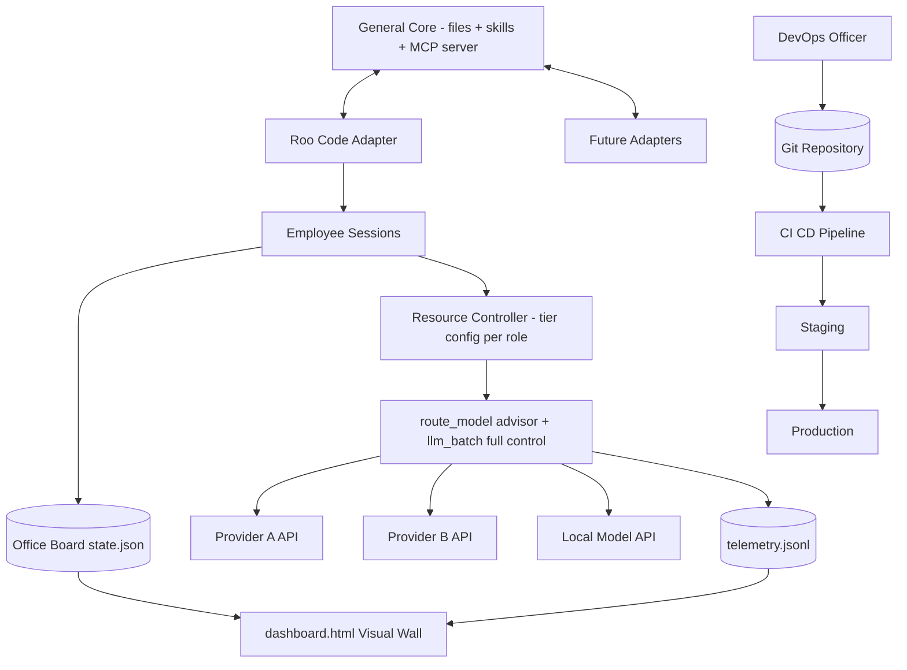
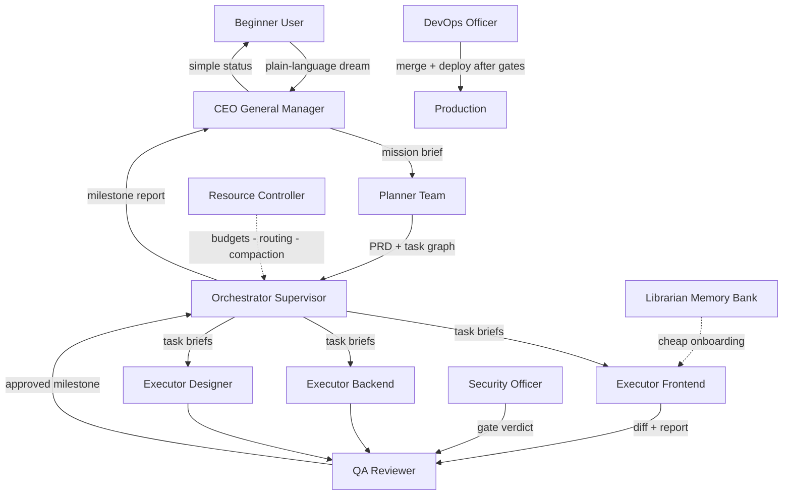
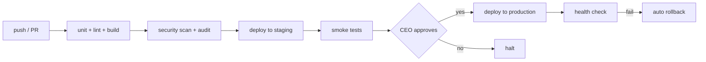

# VCNP Vibe-Office — Master Plan v2 (General Edition)

> **Vision:** A complete virtual software company living inside any AI-powered IDE. A beginner describes their dream in plain language; a hierarchy of AI employees plans it, builds it, tests it, secures it, ships it to production — while a resource controller routes every AI call to the right model at the right price, and a visual dashboard shows who does what, at what speed, cost, and quality.

**Design goal: GENERAL.** Nothing in the core depends on one person's tools, limits, or subscriptions. The core is vendor-neutral; each IDE connects through a thin adapter.

---

## 1. Design Principles

| # | Principle | Meaning |
|---|---|---|
| 1 | **Vendor-neutral core** | No hard dependency on any IDE, LLM provider, or host. Swap any of them without redesign. |
| 2 | **File-first state** | All state lives in plain JSON/Markdown — human-readable, diffable, git-versioned, works offline. |
| 3 | **Adapter pattern** | IDE-specific glue isolated in `adapters/`. First-class adapter: Roo Code. Interface documented for others. |
| 4 | **Everything measurable** | Every AI call is logged: tokens, latency, cost, outcome. Decisions are data-driven, not vibes. |
| 5 | **Progressive disclosure** | Minimal context loaded at any moment (skill-authoring standard) — the backbone of token savings. |
| 6 | **Beginner-invisible complexity** | The user sees one conversation (CEO) and one dashboard. Everything else is internal. |
| 7 | **Simple face, deep engine** | Every user-facing surface stays simple and beautiful; ALL complexity lives in backend files and the MCP server. |

---

## 2. Form Factor — Final Answer

**A hybrid kit: general core + IDE adapter + optional cloud services.**

| Layer | Vehicle | Role |
|---|---|---|
| 👥 People | Role charters instantiated as sessions/modes via the IDE adapter | Each employee = a scoped persona with permissions |
| 🎓 Training | Skills ([SKILL.md](SKILL.md) packages, skill-creator standard) | Portable capabilities |
| 🏢 Building | Local **MCP server** + file state + HTML dashboard | Shared board, ledger, telemetry, model router |
| 🚀 Delivery | Git + CI/CD + hosting recipes | Managed by the DevOps Officer |

Rejected alternatives: standalone app (duplicates the IDE, heavy maintenance), skill-only (no shared live state), MCP-only (tools without personas), VS Code plugin (overkill).

### Getting Started Reality — honest prerequisites

Success criterion #1 promises idea → production for a non-technical user. Honestly, first-time setup requires:

| Step | Reality | Mitigation |
|---|---|---|
| Install Node.js 20+ | one download, one click | walked through with screenshots in راهنمای فارسی |
| Run ONE install command | PowerShell / bash | creates the `.env` TEMPLATE automatically |
| Provide ≥1 API key | paste into `.env` | OR go keyless: a local Ollama model works with ZERO keys |
| Model catalog | pre-filled with sane defaults | changing it is optional, never required upfront |

Minimum viable start = Node + installer + one key (or keyless Ollama). Everything else is optional configuration the beginner can ignore.

---

## 3. System Architecture



---

## 4. Org Chart — 9 Employee Roles



### Role Charters

| # | Mode ID | Title | Reports To | Core Duty | Never Does |
|---|---|---|---|---|---|
| 1 | `ceo` | 👑 General Manager — مدیر کل | The User | Captures the dream in ≤5 simple questions, owns mission + milestones, reports progress in plain language | Write code, touch infra |
| 2 | `planner` | 📋 Planning Team — تیم برنامه‌ریزی | CEO | Mission → PRD → task graph with dependencies, acceptance criteria, task-class + token budgets | Implement anything |
| 3 | `orchestrator` | 🧭 Supervisor — ناظر | CEO | Single dispatcher: assigns briefs, monitors board, unblocks, escalates | Do the work itself |
| 4 | `executor` | 💻 Executor — مسئول اجرا | Orchestrator | Implements exactly ONE brief at a time; variants: frontend / backend / designer / content | Accept new scope |
| 5 | `qa` | ✅ QA Reviewer — کنترل کیفیت | Orchestrator | Tests diffs against acceptance criteria; approves/rejects with reasons; feeds quality telemetry | Fix code itself |
| 6 | `security` | 🔒 Security Officer — مسئول امنیت | CEO | Secret scans, dependency audits, OWASP basics, pipeline security; hard gate before merge/deploy | Wave anything through |
| 7 | `rc` | 💰 Resource Controller — مسئول منابع و مصرف | CEO | Token budgets, compaction orders, **model routing policy**, speed/cost/quality telemetry | Touch product code |
| 8 | `librarian` | 📚 Memory Keeper — آرشیودار | CEO | Maintains Memory Bank; any fresh session onboards in seconds | Make product decisions |
| 9 | `devops` | 🚀 DevOps Officer — مسئول سرور، پروداکشن و گیت | Orchestrator | Owns Git protocol, CI/CD, server provisioning, domains, SSL, monitoring, rollback | Deploy without QA + Security gates |

---

## 5. Communication Protocol — Handoff Envelopes

All inter-employee work moves in standard envelopes (markdown + JSON):

**Task Brief** (Orchestrator → Executor):

```json
{
  "task_id": "T-007",
  "title": "Build pricing page",
  "task_class": "C2",
  "context_refs": ["docs/PRD.md#pricing", "assets/design-system.md"],
  "acceptance_criteria": ["3 tiers rendered", "mobile responsive", "Lighthouse > 90"],
  "budget_tokens": 60000,
  "priority": "high",
  "definition_of_done": "QA approved + board updated"
}
```

**Result Report** (Executor → Orchestrator):

```json
{
  "task_id": "T-007",
  "status": "done | blocked | needs_input",
  "progress_percent": 100,
  "artifacts": ["src/pages/pricing.tsx"],
  "blockers": [],
  "notes_for_qa": "Test at 375px width"
}
```

Every envelope event appends to the event ledger [`office/events.log.jsonl`](../office/events.log.jsonl) — the append-only SOURCE OF TRUTH and audit trail: who did what, when, at what cost.

**Envelope rule:** envelopes carry NO token numbers — agents cannot count their own consumption. Real usage is recorded exclusively by the MCP server (`ledger_log` / telemetry with authoritative sources).

**Async delivery rule — no hidden bottleneck:** Executors NEVER hand results session-to-session. A finished task is written to the board with status `awaiting_orchestrator`; the Orchestrator drains this WRITTEN QUEUE on its own rhythm (event-driven `board_read`). Three executors finishing simultaneously simply enqueue — nobody waits on anyone's attention. And because the Planner ships a dependency graph, the Orchestrator dispatches dependency-free tasks to EVERY AVAILABLE executor instance — runtime parallelism = min(dependency-free tasks, open executor sessions). One IDE window means one session; the written queue serializes the rest without breaking anything. The 10× throughput claim belongs to `llm_batch`, not chat sessions.

**Contract enforcement:** the Handoff Envelope is not a convention — it is a JSON Schema. The MCP server VALIDATES every `task_create` / `task_update` against the schema BEFORE accepting; an invalid envelope is rejected with a precise error message. This is the difference between a system that works in demos and one that still works at task #50.

**Event identity & versioning:** every ledger event carries a unique `event_id` (UUID) — retries from parallel stdio processes can never double-count, and ledger replay is safe. Every state file and envelope begins with `schema_version`, so future format changes MIGRATE instead of breaking old projects.

---

## 6. Shared-State Layer — Files + MCP Server

### 6.1 Files (single source of truth)

| File | Purpose |
|---|---|
| [`office/events.log.jsonl`](../office/events.log.jsonl) | ⭐ SOURCE OF TRUTH — append-only event ledger; everything else derives from it |
| [`office/state.json`](../office/state.json) | DERIVED board cache — rebuilt from the ledger, never written in place |
| [`office/BOARD.md`](../office/BOARD.md) | Human-readable kanban mirror — regenerated from state, works even if MCP is offline |
| [`office/memory-bank/`](../office/memory-bank/) | Librarian-owned summaries: architecture, decisions, glossary |
| [`office/models.json`](../office/models.json) | Model catalog: providers, prices, speed classes (keys referenced by env name only) |
| [`office/telemetry.jsonl`](../office/telemetry.jsonl) | One line per AI call: tokens, latency, cost, outcome |
| [`office/office-live.json`](../office/office-live.json) | Living-office feed: avatar states, moods, meetings — derived automatically from real events |
| [`office/retros/`](../office/retros/) | Auto-generated RETRO.md per milestone — the office's learning loop |

### 6.2 MCP Server — `vcnp-office-mcp` (Node.js ≥ 20, stdio; ZERO npm dependencies in core — ops/monitoring tools are external services, not bundled libraries)

| Tool | Purpose |
|---|---|
| `board_init` | Create project + goal |
| `task_create` / `task_update` / `task_assign` | Board CRUD with acceptance criteria + budgets |
| `ledger_log` | Record tokens spent per role per task |
| `event_log` | Append audit event |
| `board_read` | Compact snapshot for any session |
| `report_generate` | Regenerates [`dashboard.html`](../dashboard.html) |
| `route_model` | Ask the Resource Controller policy: which model for this task class? |
| `llm_batch` | Offload bulk AI work (e.g., 50 product descriptions) through the Model Router; results written to files, cost logged — never burns main-session context |
| `telemetry_read` | Aggregated speed/cost/quality stats |
| `office_live` | Derives avatar states, moods, meetings from board + telemetry into [`office/office-live.json`](../office/office-live.json) |

Security rules baked in: writes confined to the workspace `office/` folder; events append-only; inputs validated; API keys read from env vars only.

**Concurrency model — honest version:** stdio MCP means ONE server process PER client, so parallel sessions ARE concurrent writers. Single-writer is impossible; therefore:
1. **Ledger-first:** [`office/events.log.jsonl`](../office/events.log.jsonl) is the only source of truth — appended with exclusive-create lock (`office/.lock`) + O_APPEND semantics.
2. **Derived state:** `state.json` is NEVER written in place — rebuilt from the ledger into a temp file, then ATOMICALLY renamed. Readers always see a consistent snapshot.
3. `BOARD.md` regenerates from state at report time; sessions reconcile against it on start.
4. **Idempotent appends:** every event carries a UUID `event_id`; duplicate deliveries from client retries are detected and dropped on sight.
5. **Cross-process truth — who writes what:** there is NO central live view of sessions. Each session's OWN MCP process writes util events for ITS session into the ledger while it works; the Orchestrator's assignment gate reads the LATEST util event per session from the ledger — eventually consistent, which is acceptable at task boundaries. No implementer should go looking for a centralized live state that does not exist.

### 6.3 The Living Office Wall — محیط کار زنده 🏢

The dashboard is NOT a boring chart page. It is a **living pixel-art office** — an isometric top-down scene built with pure HTML/CSS/JS (zero dependencies, zero image assets, RTL Persian-first):

- 🧑‍💻 **Each of the 9 employees has a desk and an animated avatar mirroring REAL activity:**
  - 💼 typing furiously = executor working on its brief
  - 🤔 thinking bubble = planner / orchestrator reasoning
  - ☕ coffee break = just finished a task, cooling down before the next assignment
  - 😴 sleeping = session idle beyond threshold
  - 🥱 yawning + draining energy bar = long-running task
  - 🎉 confetti = milestone approved
- 🗣️ **Meeting room:** when the Orchestrator opens coordination — planning sessions, QA + Security gate reviews, standups — the involved avatars walk to the meeting table. You literally WATCH the security gate happen as a meeting around a table.
- ⚡ **Energy system:** every employee has an energy bar fed by telemetry; the Resource Controller's compaction orders appear as coffee-refill moments.
- 🕐 **Day/night tint** follows real time; late-night overtime shows exactly who is burning tokens at 2 AM.
- 🔌 **Real-time mechanism — clean separation:** the MCP server writes RAW SIGNALS ONLY (`active_role`, `last_event_time`, energy, mood hints) into [`office/office-live.json`](../office/office-live.json). ALL animation logic lives in the dashboard app, which polls every 3 seconds. Two serving modes: (a) tiny HTTP endpoint on the running MCP server — best; (b) generated snapshot script for plain file:// opening (browsers block fetch on file://). NO hard CDN dependency — any framework code is vendored inline, so the wall works offline and behind restrictive networks.
- **Nothing is cosmetic fakery:** every animation derives from genuine board events and telemetry. The cuteness IS the monitoring.

### 6.4 Simplicity Contract

- The user sees exactly two things: the CEO conversation + one beautiful living wall.
- Everything else — state files, envelopes, telemetry, model routing, CI pipelines — is backend, invisible unless deliberately opened.

---

## 7. AI Access Layer — Honest Routing — who really controls which model

**Reality check:** an MCP tool CANNOT change the model of the IDE session that called it — the IDE/adapter picks that model. Cost control is therefore HONESTLY layered by how much control each mechanism truly has:

| Layer | Mechanism | Real Control Granularity |
|---|---|---|
| **Static** | mode → model mapping in adapter config ([`adapters/roo/roomodes.json`](../adapters/roo/roomodes.json)); Resource Controller rewrites this file as policy changes | per-role |
| **Dynamic** | Orchestrator assigns each task to the executor MODE whose tier fits; `route_model` ADVISES the choice | per-task, at role granularity |
| **Full** | `llm_batch` and any non-interactive work — calls we make ourselves through provider adapters | per-call |

```
IDE session ──── model fixed by adapter config ───────▶ Provider API     [static]
Orchestrator ── picks executor mode by tier ──────────▶ IDE session      [dynamic]
llm_batch ───── route_model decision ──▶ Provider adapter ──▶ LLM API    [full]
```

Escalation therefore means REASSIGNING a task to a stronger mode — never magically upgrading the calling session's model mid-flight.

- **Provider adapters:** any OpenAI-compatible endpoint works out of the box (OpenAI, OpenRouter, Groq, DeepSeek, Together, Mistral, local Ollama / LM Studio). Thin dedicated adapters for Anthropic and Google APIs. Each adapter declares per-model `prompt_cache` support in [`office/models.json`](../office/models.json) — when a provider offers it (Anthropic, several OpenAI-compatible APIs), STATIC context blocks (constitution, Memory Bank architecture) are cached: faster AND cheaper.
- **Configuration** in [`office/models.json`](../office/models.json):

```json
{
  "providers": [
    { "id": "openrouter", "base_url_env": "OPENROUTER_BASE_URL", "key_env": "OPENROUTER_API_KEY", "kind": "openai-compatible" },
    { "id": "local", "base_url_env": "OLLAMA_BASE_URL", "key_env": null, "kind": "openai-compatible" }
  ],
  "models": [
    { "id": "economy-fast", "provider": "openrouter", "model_ref": "...", "in_price": 0.05, "out_price": 0.2, "ctx": 128000, "speed_class": "fast", "quality_tier": 1 },
    { "id": "standard",     "provider": "openrouter", "model_ref": "...", "in_price": 0.5,  "out_price": 1.5, "ctx": 200000, "speed_class": "medium", "quality_tier": 2 },
    { "id": "premium",      "provider": "openrouter", "model_ref": "...", "in_price": 3.0,  "out_price": 15.0, "ctx": 200000, "speed_class": "slow", "quality_tier": 3 },
    { "id": "local-free",   "provider": "local",      "model_ref": "...", "in_price": 0, "out_price": 0, "ctx": 32000, "speed_class": "medium", "quality_tier": 1 }
  ]
}
```

- **Secrets:** raw keys live ONLY in `.env` (gitignored from day one); config references env variable names.
- **Fallback chain:** primary provider → secondary provider → local model. Automatic failover on outage or rate limit; failovers are logged.
- **`llm_batch`:** bulk generation runs OUTSIDE chat sessions — cheap models, file-based results, full cost accounting. This is how the office gets 10× work out of the same token budget.

### `llm_batch` Specification — complete contract

| Aspect | Decision |
|---|---|
| Model | ASYNC job system — `llm_batch.submit(jobs[], model_class)` returns a `batch_id` INSTANTLY |
| Completion | Results written to [`office/batches/<batch_id>/`](../office/batches/) as files + a `batch_done` event appended to the ledger |
| Who waits | NOBODY blocks. The Orchestrator sees `batch_done` on its next `board_read` and spawns a follow-up task if needed |
| Retries | Per-item: 3 attempts with exponential backoff; failures quarantined to `failed.jsonl` — a batch NEVER blocks the pipeline |
| Parallelism | Multiple batches allowed; a global `max_concurrent` cap in [`office/models.json`](../office/models.json) protects provider rate limits |
| Cost | Accumulated per batch from provider `usage` fields; logged with `source: provider_usage` |

---

## 8. Model Selection Policy — Speed × Intelligence × Cost

### Routing Matrix (set by Planner per task, enforced by Resource Controller)

| Task Class | Examples | Default Tier | Rationale |
|---|---|---|---|
| **C0 Spike** | time-boxed approach discovery BEFORE C3/C4 — hard cap ~5k tokens, NO deliverable; the only output is a written decision in the Memory Bank | Economy / local | Prevents burning premium budget on the wrong path |
| **C1 Trivial** | boilerplate, formatting, renames, translations | Economy / local | Cost-dominant |
| **C2 Standard** | components, clear-spec bugfixes, content | Standard | Balanced |
| **C3 Complex** | architecture, gnarly debugging, security review | Premium | Quality-dominant |
| **C4 Wide-context** | repo-wide analysis, big refactors | Large-context model | Capacity-dominant |

**C1 fast-path:** trivial tasks SKIP the full Planner → Orchestrator → Executor → QA cycle — the CEO dispatches directly to an executor on a local/economy model with a tiny hard budget cap and an automated check. Latency for small jobs collapses.

**Cap honesty:** token caps — C0's ~5k, per-task budgets — are HARD only where MCP controls the call (`llm_batch`) and at task-boundary gates checked against authoritative `ide_export` data. Inside a live IDE session they are ADVISORY, labeled «estimated cap». We do not pretend otherwise.

### Selection Algorithm — ONE rule, auditable

**Rule: pick the CHEAPEST model whose expected quality ≥ the task's quality bar.**
Constrained minimum on cost — explainable and auditable. The value score below is used ONLY for dashboard leaderboard ranking, NEVER for decisions:

```
value(model) = expected_quality / (cost_per_task × latency_penalty)   ← ranking only
```

- **Cold start:** expected quality is a Bayesian-smoothed approval rate seeded by `quality_tier`, updated with every QA verdict:
  `q̂ = (approvals + a) / (approvals + rejections + a + b)` where a, b derive from the tier prior — so the first 20 tasks are guided by priors, not randomness.
- **Escalation ladder (reassignment, not model-swapping):** QA rejects ×2 on a task → Orchestrator REASSIGNS it to a higher-tier MODE. Rejects ×3 → mandatory premium-mode review. Every bump is logged as a lesson in the Memory Bank.
- **De-escalation — wired:** the Resource Controller aggregates QA verdicts per model+class from [`office/telemetry.jsonl`](../office/telemetry.jsonl); `route_model` reads these aggregates automatically. At ≥95% approval across the last 20 verdicts — counted PER model+class PAIR, never across classes (a C1 star does not become a C3 qualifier) — RC applies the downgrade AUTONOMOUSLY, logs a `tier_downgrade` event, and notifies the CEO, who may veto in review (revert = one git commit). Anti-oscillation: after ANY tier flip, a cooldown of ≥5 verdicts at the new tier passes before another flip; the normal escalation ladder still catches a bad downgrade (2 rejections → back up).
- **Local-first draft, premium-verify:** for suitable C3 tasks, draft on economy/local and spend premium tokens ONLY on review/refinement — often sufficient quality at a fraction of the cost.
- **Auto-retrospective — the learning loop:** after every milestone the Librarian (with RC data) reads [`office/events.log.jsonl`](../office/events.log.jsonl) + telemetry and generates a RETRO.md in [`office/retros/`](../office/retros/): which task class drew the most rework, which model collected the most QA rejections, where budgets overflowed. Findings feed DIRECTLY into `models.json` tier settings and the Planner's future estimates. The office becomes a learning organism, not just a runner.

### What Gets Measured (per call, per role, per model)

| Dimension | Metric | Source |
|---|---|---|
| ⚡ Speed | avg latency, wall-clock per task | telemetry timestamps |
| 🧠 Intelligence | QA approval rate, rework count, test pass rate | QA verdicts + CI |
| 💸 Cost | $ per call, $ per approved task, $ per milestone | price tables × tokens |

Dashboard panels render all three live: budget gauges, model value leaderboard, slowest-stage detector.

**Cost-truth policy:** agents CANNOT count their own tokens — self-reported numbers are estimates, never facts. Every telemetry line carries a `source` field:
- `provider_usage` — authoritative, from llm_batch API responses (the only source that can enforce budgets per-call)
- `ide_export` — periodic import of IDE/provider usage reports (authoritative for session spend)
- `estimated` — agent self-report; shown in the dashboard SEPARATELY and labeled «تخمینی»

Budget enforcement uses ONLY the first two sources. Without this tag, telemetry is decoration, not instrumentation.

---

## 9. DevOps Protocol — Server, Production, Git

### Git Protocol

- **Branches:** `main` = production · `develop` = integration · `feature/T-007-pricing-page` per task
- **Commits:** conventional format referencing task id — `feat(pricing): add tier cards [T-007]`
- **Merge gate (all three required):** QA approved ∧ Security passed ∧ CI green
- **Releases:** tagged `vX.Y.Z`; **rollback = redeploy previous tag** (one command)

### CI/CD Pipeline (GitHub Actions by default, adaptable)



### Hosting Abstraction (inside `deploy-server` skill)

Target-agnostic recipes; DevOps asks the user ≤3 plain questions (domain? budget? traffic?) then picks:

| Recipe | Fits | Tools |
|---|---|---|
| Static site → global CDN | landing pages, portfolios | any static host + CI upload |
| Node app → VPS | dynamic sites, APIs | SSH + process manager + Nginx + SSL |
| Node app → PaaS | zero-ops preference | platform CLI + CI plugin |

Post-deploy: uptime ping + error monitoring hooked into the dashboard event feed.

---

## 10. Resource Economy — صرفه‌جویی

Enforced by the Resource Controller, written into the office constitution:

1. Right-size the model per task class (routing matrix above).
2. Task-scoped context: workers receive ONLY their brief + referenced files.
3. Memory Bank summaries replace expensive repo re-reads.
4. **Compaction — deterministic emitter, honest scope:** WITHIN a task, the ≥60% rule stays advisory — nothing can interrupt a live IDE session. AT TASK BOUNDARIES the gate is HARD, and `compaction_done` has a DETERMINISTIC writer — never an agent's promise:
   - **Primary:** the explicit MCP tool `compaction_ack(session_id, util_after)` — the session calls it immediately after performing its Librarian hand-off; MCP validates (`util_after` below threshold AND the Memory Bank file actually updated) and appends the event atomically.
   - **Secondary:** where the adapter supports hooks, detecting the IDE's native compact action writes the SAME event automatically.
   - **Freshness:** a `compaction_done` counts ONLY if it is the LATEST util-related event for that session — yesterday's compact does not survive today's heavy task.
   - Starvation is impossible: the ack tool is always callable, so the gate can always be satisfied by doing the work.
   - **EMERGENCY above 75%:** RC can only NOTIFY a live session — advisory unless the adapter hook exists; with the hook, emergency compaction rides the same channel. Labeled accordingly.
5. Diff-based reviews, never whole-file reads.
6. Bulk work goes through `llm_batch` on economy models, not chat sessions.
7. Every task carries a token budget; overspend requires Resource Controller approval.
8. **Dry-run / plan-only mode:** the user can say «فقط بگو چه می‌خواهی بکنی و چقدر خرج دارد» — the Planner produces PRD + budget/time estimate and NOTHING executes until the user approves. Trust first, spend later.
9. **Cost circuit breaker:** an absolute spend ceiling per session AND per milestone — at 80% the RC logs `budget_warning`; at 100% work HALTS and escalates to the CEO. A top-level emergency brake, distinct from per-task budgets.
10. **Semantic cache for llm_batch:** cache key = hash(**model + parameters + system prompt + input**) — NEVER input alone, or a different model would silently return another model's cached answer. With the correct key, duplicate calls simply vanish.

---

## 11. Security Protocols — امنیت

1. Secrets only in `.env` (gitignored day one); never pasted into chats or configs.
2. Merge/deploy gate: secret scan + dependency audit + OWASP-top-10 basics checklist.
3. Pipeline security: CI runs with minimal permissions; deploy credentials scoped and rotated.
4. Destructive-command guard: `rm` / `del` / `format` / DB drops require explicit user approval.
5. Sandbox preview before any production deploy.
6. Immutable audit trail by construction: the event ledger ([`office/events.log.jsonl`](../office/events.log.jsonl)) is append-only AND the source of truth — immutability is architecture, not a slogan.
7. **Gate liveness:** the Security gate has an SLA — if the Security session is unresponsive (2 pings / 30 min), the Orchestrator escalates to the CEO, who either spawns a fresh Security session or signs a TEMPORARY WAIVER recorded in the ledger — valid for NON-production merges only. Production deploys ALWAYS require a real Security pass. No exceptions.
8. **Enforcement layer — hooks, not promises (CRITICAL):** charters are context, NOT enforcement. Dangerous operations — `rm -rf`, `git push --force`, writes outside the workspace, reading `.env` — are HARD-BLOCKED at the IDE/adapter level via pre-tool-use hooks installed by the installer. The model is never trusted to police itself; architecture does the policing.
9. **Secret scanning at TWO points:** a pre-commit hook (gitleaks-style) + a CI gate — defense in depth. A secret must never even ENTER a commit, let alone production.
10. **Approval provenance — four-eyes:** every approval records WHO approved, WHEN, and against WHICH artifact/diff hash — making the audit trail defensible, not decorative.
11. **Least-privilege adapters:** the Git adapter never sees deploy credentials and vice versa — each adapter reads ONLY its own env keys, capping the blast radius of any leaked credential.
12. **Kill switch + safe-stop protocol:** ONE command halts the entire organization — all sessions, running batches, pending deploys — also exposed as a dashboard button. Safe-stop semantics: in-flight batch results are QUARANTINED to `office/batches/<id>/partial/` with a manifest — never silently dropped; the git tree is left untouched but recorded in the `kill_event` with its dirty-file list; pending deploys are frozen via CI API cancellation. Recovery = ledger replay rebuilds state; sessions resume from Memory Bank summaries. Only the CEO role may pull it; every pull logs who and when.

---

## 12. Capability Skills Installed Into the Office

Each follows skill-creator standards: SKILL.md < 500 lines, YAML frontmatter, details in `references/`, boilerplate in `assets/`.

| Skill | Trains Who | Content |
|---|---|---|
| `core-constitution` | Everyone | Office law: roles, permissions, escalation paths |
| `core-protocol` | Everyone | Handoff envelopes, async queue rules, compaction protocol |
| `core-board-ops` | Orchestrator + RC | Board CRUD discipline, ledger hygiene, queue draining |
| `web-design` | Designer / Executors | Landing pages, responsive layout, design-system basics |
| `deploy-server` | DevOps | Hosting recipes, domains, SSL, CI/CD patterns |
| `security-basics` | Security Officer | Checklists a non-techie can trust |
| `smart-resources` | Resource Controller + all | Model routing playbook, token diet, batch offloading |

---

## 13. Repository Structure

```
VCNP-VibeOffice/
├── adapters/
│   └── roo/                  # FIRST-CLASS adapter: modes, rules, MCP registration
│       ├── roomodes.json
│       └── rules/
├── core/                     # VENDOR-NEUTRAL: role charters, envelope spec, constitution
│   ├── charters/             # 9 role charters (markdown)
│   └── protocol.md           # handoff envelope specification
├── skills/                   # the 7 installed skills — 3 core + 4 capability
├── mcp/vcnp-office-mcp/      # Node MCP server: board, ledger, router, telemetry, llm_batch
├── templates/dashboard.html  # visual wall template (RTL-ready, Persian-first)
├── installer/
│   ├── install.ps1           # Windows one-click: adapter + skills + MCP registration
│   └── install.sh            # macOS/Linux — same behavior
├── demo/                     # golden-path sample website built BY the office
├── docs/
│   ├── RAHNAMA-FA.md         # PRIMARY — Persian beginner manual — راهنمای فارسی
│   └── README.md             # Brief English overview for developers
└── plans/
```

---

## 14. Implementation Phases

| Phase | Deliverable |
|---|---|
| **P0** | Scaffold repository structure |
| **P1** | 9 role charters + Roo adapter mode definitions |
| **P2** | Core skills trio — constitution / protocol / board-ops + envelope spec |
| **P3** | Capability skills: web-design, deploy-server, security-basics, smart-resources |
| **P4** | MCP server: board, ledger, `route_model`, `llm_batch`, telemetry + envelope schema validation + UUID idempotency + INSTALLER MVP — rough but working, so real users can test early |
| **P5** | Demo golden path END-TO-END tested WITH A REAL BEGINNER + wall MVP (text statuses + progress bars): idea → tasks → git → CI → staging → production |
| **P6** | Living Office Wall pixel-art — STRICTLY scoped: 9 avatars + desks + meeting room first; energy bars and day/night tint only after the core ships |
| **P7** | Installer polish + uninstaller |
| **P8** | Persian beginner manual + model catalog setup guide |

---

## 15. Risks & Mitigations

| Risk | Mitigation |
|---|---|
| Mode sprawl / role confusion | Strict charter per role; Orchestrator is the ONLY dispatcher |
| Orchestrator becomes a reply bottleneck under parallel tasks | Written queue on the board — status `awaiting_orchestrator`; results NEVER delivered session-to-session |
| Security Officer session unavailable blocks the pipeline | Gate SLA + CEO escalation + temporary waiver for non-production merges only; production always requires a real pass |
| Concurrent writers corrupt state — stdio MCP means one process PER client | Ledger-first: [`office/events.log.jsonl`](../office/events.log.jsonl) append-only is the sole source of truth; state.json derived via temp + atomic rename; BOARD.md reconciliation on session start |
| Coordination overhead eats savings | Budgets include coordination tax; C1 work on economy/local models |
| Provider outage / price change | Fallback chains + `models.json` price refresh procedure |
| Beginner overwhelm | User sees ONLY the CEO conversation + dashboard |
| Bad deploy reaches users | Triple gate (QA ∧ Security ∧ CI) + staging + auto-rollback |
| Dashboard scope creep — the pixel-art office is the roadmap's biggest unknown | Wall MVP (text + progress bars) ships in P5; pixel-art P6 strictly scoped: avatars/desks/meeting-room first, energy + day-night deferred |
| Beginner onboarding friction — Node, keys, installer | Getting Started Reality section; keyless local-Ollama path; installer generates `.env` template + default catalog |

---

## 16. Success Criteria

1. Non-technical user goes **idea → live production URL** talking only to the CEO.
2. Dashboard shows truthful per-task and overall progress %, plus live spend vs budget.
3. Model routing demonstrably cuts cost (economy models handle C1/C2; premium only where earned).
4. Telemetry proves speed/quality/cost per role and per model.
5. Security gate demonstrably blocks a bad merge and a bad deploy.
6. Fresh sessions onboard in under a minute via the Memory Bank.
7. Swapping any single provider or IDE requires touching only config/adapter files.
8. The living office wall reflects real activity — meetings, sleep, tiredness, celebrations — making monitoring fun enough that the user actually watches it.
9. Cost figures on the dashboard are trustworthy: budgets react only to `provider_usage` / `ide_export` sources; agent estimates are visibly labeled «تخمینی».

---

## 17. Resolved Decisions

1. **Generality:** ✅ Vendor-neutral core (`core/` + files + MCP); Roo Code ships as the first-class adapter; adapter interface documented for future IDEs.
2. **Documentation language:** ✅ Persian-first — [`docs/RAHNAMA-FA.md`](../docs/RAHNAMA-FA.md) primary; [`docs/README.md`](../docs/README.md) brief English overview.
3. **Dashboard language:** ✅ Persian-first UI, RTL layout, English labels as fallback.
4. **AI access:** ✅ Any OpenAI-compatible provider + Anthropic/Google adapters + local models; keys via env only; automatic fallback chains.
5. **Delivery:** ✅ Git + GitHub Actions CI/CD default, staging-before-production, one-command rollback.
6. **Routing honesty:** ✅ Three-layer control adopted — static per-role (adapter config), dynamic per-task (reassignment via Orchestrator), full per-call (`llm_batch`). No fictional per-session model switching.
7. **State integrity:** ✅ Ledger-first event sourcing — append-only ledger as source of truth, derived state with atomic writes; concurrency handled without a single-writer myth.
8. **Telemetry honesty:** ✅ Source-tagged metrics (`provider_usage` / `ide_export` / `estimated`); only authoritative sources drive budgets.
9. **Dashboard separation:** ✅ MCP emits raw signals only; all animation/UI logic lives in the dashboard app; no hard CDN dependency (vendored inline for offline + restrictive networks).
10. **Build-order honesty:** ✅ End-to-end demo BEFORE visual investment (P5 ⇄ P6 swap); `llm_batch` fully specified as async jobs; Orchestrator decoupled via written queue; compaction and de-escalation wired to concrete mechanisms; Security gate given SLA + fallback.
11. **Hardening v3:** ✅ Adopted in full — auto-retrospective learning loop, C0 spike class, dry-run mode, envelope JSON-Schema contract testing, UUID idempotency, schema versions, speculative parallelism, prompt caching, C1 fast-path, cost circuit breaker, semantic batch cache, draft-then-verify routing, adapter-level enforcement hooks, dual secret scanning, approval provenance, least-privilege adapters, and a global kill switch.
12. **Honesty audit v4:** ✅ Compaction gated at task boundaries by MCP — advisory within live tasks, stated plainly; token caps labeled hard-vs-advisory; semantic cache keyed on model+params+prompt; installer MVP pulled forward to P4 for real-user testing; kill switch given a safe-stop protocol; de-escalation scoped per model+class with anti-oscillation cooldown; Getting Started Reality added; dashboard scope guarded by a wall MVP.
13. **Compaction wiring v5:** ✅ `compaction_ack` MCP tool adopted as the deterministic emitter (adapter hook as secondary channel); freshness defined as latest-util-event-per-session; the gate reads ledger snapshots — eventually consistent, explicitly stated; emergency >75% labeled advisory-without-hook; speculative parallelism honestly bounded by min(tasks, open sessions).
